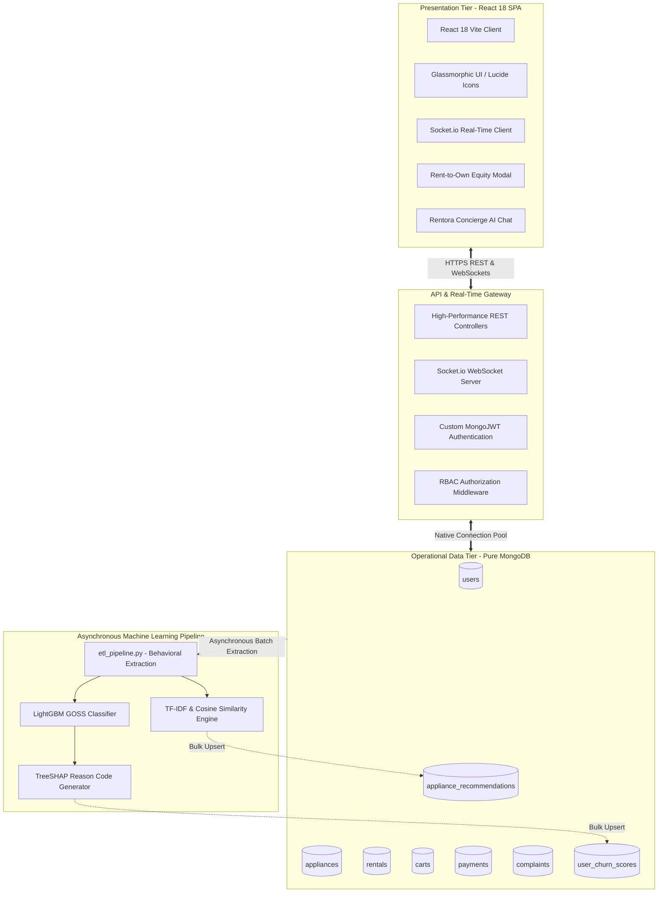

# SDC-II Project Architecture: Rentora System

This document formalizes the system architecture, component decomposition, and module breakdown for the **Rentora** platform, developed for the **SDC-II (Software Development Cell - II)** capstone curriculum. The architecture is cleanly divided into 15 distinct, highly cohesive development modules built on a **unified, high-performance MongoDB NoSQL architecture**, a **responsive React 18 Single Page Application (SPA)**, a **high-throughput RESTful API with real-time WebSockets**, and **asynchronous Machine Learning pipelines**.

---

## High-Level Architecture Overview

---

## 15-Module System Breakdown

### 1. User Authentication & Profile Management
* **Functionality**: Customer and admin registration, secure login sessions, and profile updates.
* **Security & Tokens**: Cryptographic PBKDF2 password hashing and custom stateless JWT access (60m) & refresh (7d) tokens.
* **Data Layer**: Interacts directly with the MongoDB `users` collection.

### 2. Multi-Role RBAC (Role-Based Access Control)
* **Functionality**: Strict authorization partitioning across 3 roles: `customer`, `owner` (peer lessor/vendor), and `admin`.
* **Portals**: Customer Home/Catalog, Peer Vendor Dashboard (`OwnerDashboard.jsx`), and System Admin Dashboard (`AdminDashboard.jsx`).

### 3. Appliance & Furniture Inventory Management
* **Functionality**: Master catalog management across 84+ appliances and furniture items with multi-city stock filtering (Bangalore, Mumbai, Delhi-NCR, Hyderabad, Pune).
* **Data Layer**: Stored in MongoDB `appliances` collection with rich, dynamic document schemas.

### 4. Dynamic Tenure Pricing Engine
* **Functionality**: Real-time calculation of tiered rental discounts across 3-month, 6-month, and 12-month commitments, security deposits, and taxes.

### 5. Mandatory KYC Verification Security Gateway
* **Functionality**: Mandatory upload of identity and address proofs before checkout. Unverified users receive HTTP 403 Forbidden to eliminate leasing fraud.

### 6. Rental Booking & Atomic Inventory Engine
* **Functionality**: Cart persistence and thread-safe checkout reservation.
* **Data Layer**: Executes atomic MongoDB `$inc: {"stock_quantity": -1}` operations and writes active leases to the `rentals` collection.

### 7. Rentora Shield (Accidental Damage Waiver)
* **Functionality**: Built-in ₹10,000 accidental damage protection waiver and 100% escrow security deposit refund protection.

### 8. Asset Return Processing & Refurbishment
* **Functionality**: Lease termination, damage level evaluation, deposit refund processing, and automated inventory restocking (`$inc: {"stock_quantity": 1}`).

### 9. Asynchronous ETL Machine Learning Pipeline
* **Functionality**: Python pipeline ([etl_pipeline.py](file:///c:/Users/dhran/Desktop/RentAI/ml_pipeline/etl_pipeline.py)) compiling user behavioral engagement metrics from MongoDB collections without locking live transactional data.

### 10. Predictive Churn Classification Engine (LightGBM)
* **Functionality**: LightGBM GOSS classifier predicting churn risk probability with **95.33% Accuracy** and **99.10% ROC-AUC**.

### 11. Explainable AI (TreeSHAP Reason Code Generator)
* **Functionality**: Game-theoretic local feature attributions converted into actionable, human-readable retention reason codes.

### 12. Personalized Catalog Recommender
* **Functionality**: Sublinear TF-IDF vectorization and Cosine Similarity matrices delivering instant personalized Top-6 recommendations.

### 13. Rent-to-Own Equity Builder & Ownership Certificates
* **Functionality**: Accrues up to 70% of lease payments as equity towards asset buyout, complete with an interactive buyout calculator and tamper-evident printable ownership certificates.

### 14. UNLMTD Subscriptions & Curated Combos
* **Functionality**: Whole-home 1 BHK, 2 BHK, and 3 BHK packages with zero deposit, free annual style refreshes, and 1-click room bundles.

### 15. Real-Time Field Logistics Tracker & Rentora Concierge AI
* **Functionality**: Live Socket.io WebSocket field technician dispatch tracking across 5 fulfillment milestones, paired with a context-aware 24/7 AI chatbot assistant.
