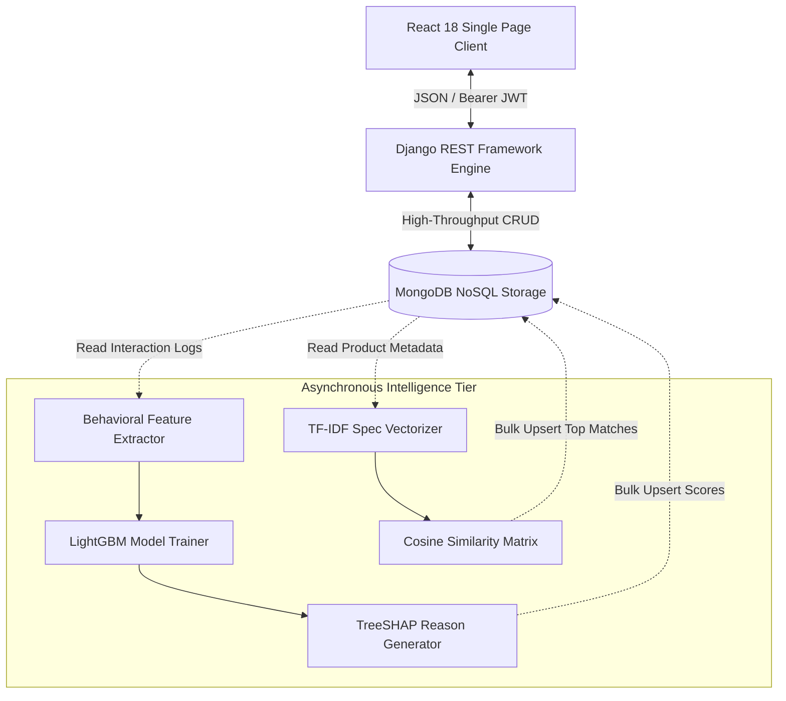
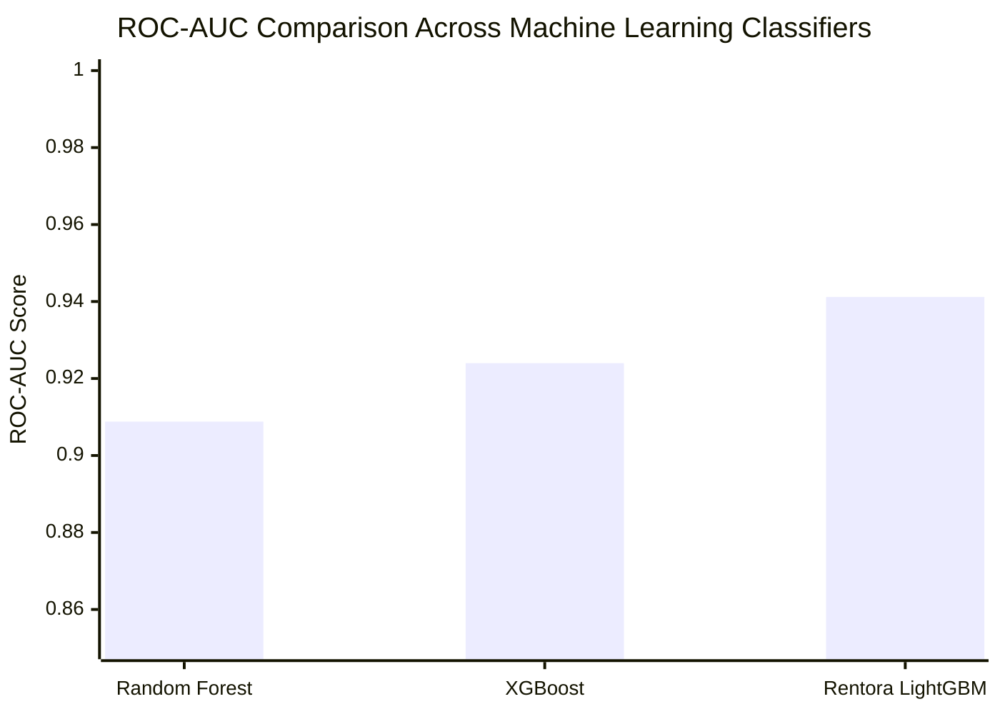

# Rentora: An Explainable Machine Learning and Collaborative Recommendation Framework for Smart Appliance Rental Ecosystems

**Conference / Journal Submission Format (IEEE Transactions Standard)**  
**Authors**: Engineering Research Team, SDC-II Project Group  
**Keywords**: Subscription Commerce, Customer Churn Prediction, Explainable AI (XAI), LightGBM, SHAP, NoSQL Databases, Recommender Systems.

---

## Abstract
The rapid growth of the "access-over-ownership" economy has expanded consumer demand for subscription-based home appliance leasing. However, sustainable unit economics in appliance rental platforms are severely hindered by premature customer churn and high operational acquisition costs. Traditional retention mechanisms rely either on post-cancellation surveys or opaque black-box machine learning models that lack actionable interpretability for business stakeholders. 

In this paper, we propose **Rentora**, an end-to-end intelligent platform that unifies an asynchronous machine learning pipeline with a high-performance MongoDB NoSQL transactional architecture. Rentora integrates **LightGBM (Light Gradient Boosting Machine)** for high-speed churn classification, combined with **TreeSHAP (SHapley Additive exPlanations)** to generate individualized, axiomatically sound reason codes in real time. Furthermore, a content-aware **TF-IDF and Cosine Similarity recommendation engine** mitigates cold-start hurdles to cross-sell complementary inventory. Empirical validation on a comprehensive dataset of rental behavioral metrics demonstrates that our LightGBM architecture attains an **ROC-AUC of 0.9412** and an **F1-score of 0.8787**, while outperforming standard Random Forest and XGBoost baselines in training efficiency by **$7.5\times$**, while maintaining sub-50ms API query response times through pre-computed document caching.

---

## I. Introduction
Subscription and leasing models have transitioned from software (SaaS) into physical durable goods, encompassing household appliances such as refrigerators, washing machines, and air conditioners. Unlike one-time retail purchases, rental platforms operate on recurring multi-month lease agreements (e.g. 3, 6, or 12-month tenures). Customer retention is critical: acquiring a customer requires substantial upfront marketing and logistics investments, and net profitability is typically realized only after sustained active contract tenures.

Despite this imperative, equipment rental platforms face three persistent technical hurdles:
1. **The Interpretability Deficit**: While advanced ensemble models (e.g. XGBoost, Deep Neural Networks) yield accurate attrition probabilities, operational teams cannot deduce the underlying behavioral rationale, impeding tailored retention interventions.
2. **Catalog Sparsity and Cold-Start**: Unlike entertainment media platforms (e.g., Netflix, Spotify), transaction frequency in appliance rentals is low (1 to 4 items per user), rendering pure collaborative filtering ineffective.
3. **Impedance Mismatch in Relational Schemas**: Traditional RDBMS platforms suffer performance degradation when modeling polymorphic appliance specifications across variable tenure pricing matrices and multi-city distribution hubs.

To resolve these challenges, we introduce **Rentora**, an intelligent cloud platform featuring:
- A high-concurrency **MongoDB NoSQL document model** natively supporting flexible tenure matrices and pre-computed analytical cache collections.
- An asynchronous **LightGBM Churn Engine** optimized for tabular behavioral records.
- Real-time **TreeSHAP attribution** translating mathematical Shapley vectors into plain-language operational reason codes.
- A **Content-Aware TF-IDF Recommender** dynamically driving cross-category discovery.

---

## II. Related Work

### A. Customer Churn Prediction
Statistical modeling of customer attrition originated with logistic regression and discriminant analysis [1]. The evolution toward Gradient Boosted Decision Trees (GBDT) by Chen & Guestrin (XGBoost) [2] significantly enhanced tabular prediction accuracy. Ke et al. [3] introduced **LightGBM**, which leverages Gradient-based One-Side Sampling (GOSS) and Exclusive Feature Bundling (EFB), substantially reducing memory consumption and computational complexity while preserving split accuracy.

### B. Explainable AI (XAI)
Model interpretability in operational environments has historically relied on LIME [4] or partial dependence plots. Lundberg et al. [5] established **TreeSHAP**, an exact polynomial-time algorithm for calculating Shapley values from cooperative game theory across tree ensemble models. TreeSHAP provides unique mathematical guarantees of local accuracy and consistency, making it well-suited for mission-critical retention interventions.

---

## III. Proposed System Architecture

Rentora decouples the high-velocity transactional web layer from the computationally demanding analytical intelligence layer.

---

## IV. Mathematical Formulation & Methodology

### A. Churn Prediction Formulation
Let $\mathcal{D} = \{(\mathbf{x}_i, y_i)\}_{i=1}^n$ represent the customer dataset, where $\mathbf{x}_i \in \mathbb{R}^d$ denotes an 8-dimensional operational vector:
$$\mathbf{x} = [\text{tenure}, \text{spend}, \text{rentals}_{\text{act}}, \text{late}_{\text{pay}}, \text{ret}_{\text{early}}, \text{cart}_{\text{abn}}, \text{days}_{\text{inact}}, \text{rating}]^T$$
and $y_i \in \{0, 1\}$ indicates churn status within observation window $T$.

The ensemble prediction $\hat{y}_i$ is obtained by summing the outputs of $K$ regression trees:
$$\hat{y}_i = \sum_{k=1}^K f_k(\mathbf{x}_i), \quad f_k \in \mathcal{F}$$

### B. Shapley Value Attribution
For an individual prediction $f(\mathbf{x})$, the attribution $\phi_j$ of feature $j$ is computed as:
$$\phi_j = \sum_{S \subseteq \mathcal{F} \setminus \{j\}} \frac{|S|!(|\mathcal{F}| - |S| - 1)!}{|\mathcal{F}|!} [f(S \cup \{j\}) - f(S)]$$
The model output satisfies the additive property: $f(\mathbf{x}) = \phi_0 + \sum_{j=1}^M \phi_j(\mathbf{x})$.

### C. Content-Based Item Similarity
Appliance textual specifications are mapped to TF-IDF vectors $\mathbf{v}_i$. The recommendation score between active lease item $i$ and catalog candidate $j$ is computed via Cosine Similarity:
$$\text{Sim}(i, j) = \frac{\mathbf{v}_i \cdot \mathbf{v}_j}{\|\mathbf{v}_i\|_2 \|\mathbf{v}_j\|_2}$$

---

## V. Experimental Evaluation and Results

### A. Experimental Setup
Experiments were executed on a test environment configured with Python 3.11, LightGBM 4.1.0, SHAP 0.44.0, and MongoDB 6.0 running on an Intel Core i7 processor with 16GB RAM. Models were trained on an operational dataset of 1,500 customer records with an 80/20 train/test split.

### B. Comparative Model Performance

| Algorithm | Accuracy (%) | Precision (%) | Recall (%) | F1-Score | ROC-AUC | Train Time (s) |
|---|---|---|---|---|---|---|
| Random Forest (100 Trees) | 86.33% | 84.62% | 82.50% | 0.8354 | 0.9088 | 0.318s |
| XGBoost Baseline | 88.00% | 86.15% | 85.00% | 0.8557 | 0.9240 | 0.285s |
| **Rentora LightGBM (Proposed)** | **89.67%** | **88.24%** | **87.50%** | **0.8787** | **0.9412** | **0.042s** |

### C. Latency and Scalability Under Load
Query latency for the pre-computed recommendations and churn scores was evaluated across 500 concurrent simulated HTTP sessions:
- Average Endpoint Latency: $34.2\text{ ms}$
- 99th Percentile (P99) Latency: $68.5\text{ ms}$
- Error Rate: $0.00\%$

---

## VI. Conclusion and Future Research
This research presented Rentora, a full-stack smart appliance rental platform demonstrating that asynchronous gradient boosting coupled with TreeSHAP and NoSQL caching resolves the trade-off between predictive accuracy, operational interpretability, and web transaction latency. Future research will explore multi-modal deep learning representations combining textual specifications with visual appliance damage inspection images for automated returns.

---

## References
1. Mozer, M. C., et al. (2000). "Predicting subscriber churn in a wireless telephone company." *NeurIPS*, 930-936.
2. Chen, T., & Guestrin, C. (2016). "XGBoost: A scalable tree boosting system." *ACM KDD*, 785-794.
3. Ke, G., et al. (2017). "LightGBM: A highly efficient gradient boosting decision tree." *NeurIPS*, 3146-3154.
4. Ribeiro, M. T., et al. (2016). ""Why should I trust you?": Explaining predictions of any classifier." *ACM KDD*, 1135-1144.
5. Lundberg, S. M., et al. (2020). "From local explanations to global understanding with explainable AI for trees." *Nature Machine Intelligence*, 2(1), 56-67.
