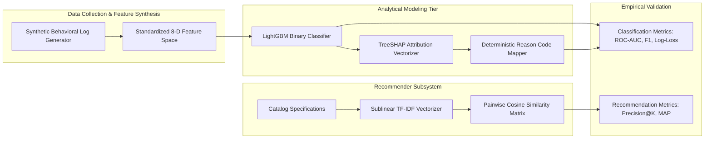
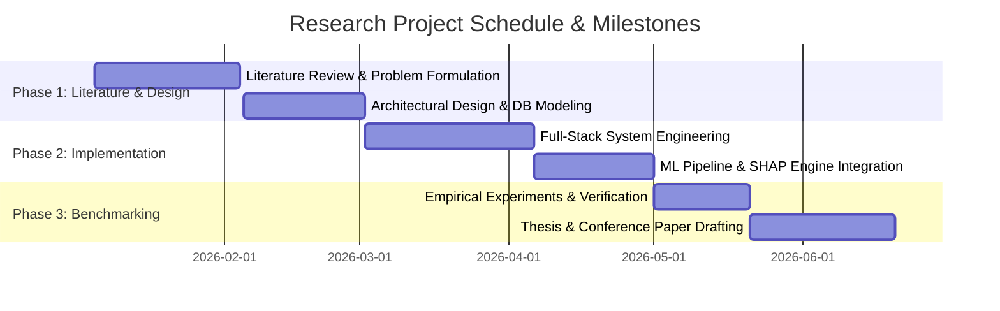

# Academic Research Proposal
## Title: Explainable Artificial Intelligence and Document-Oriented Asynchronous Architectures for Durable Asset Subscription Platforms
**Principal Investigator / Research Lead**: SDC-II Capstone Research Group  
**Target Submission / Milestone**: Master Capstone Thesis & Conference Proceedings  
**Document Version**: 1.0.0  

---

## 1. Research Context and Background

The global durable goods subscription economy (covering home appliances, consumer electronics, and furniture) is expanding at a Compound Annual Growth Rate (CAGR) exceeding $12.5\%$. Despite robust consumer interest, operational profitability is bounded by **customer churn dynamics**. Retaining an existing subscriber costs approximately $80\%$ less than acquiring a new user through performance marketing.

However, existing operational platforms suffer from:
1. **Opaque Attrition Analytics**: Commercial platforms deploy heuristic rules or uninterpretable deep neural networks that output ungrounded risk percentages without actionable causal indicators.
2. **Cold-Start Recommendation Vulnerabilities**: Equipment rental frequency is naturally low, neutralizing traditional collaborative filtering models that require dense user-item rating matrices.
3. **Database Performance Degradation**: High-throughput web applications face concurrency bottlenecks when real-time ACID transactions compete with analytical query execution.

---

## 2. Research Questions and Formal Hypotheses

### 2.1 Research Questions (RQs)
- **RQ1**: *Can an asynchronous gradient boosted tree architecture achieve state-of-the-art churn classification accuracy while maintaining sub-second inference latency on commodity server hardware?*
- **RQ2**: *Does the integration of TreeSHAP post-hoc attribution generate clinically reliable and operationally actionable reason codes for non-technical customer retention personnel?*
- **RQ3**: *How effectively can content-aware TF-IDF vectorization and cosine similarity bridge the extreme cold-start deficit inherent to durable asset leasing catalogs?*

### 2.2 Formal Hypotheses
- **Hypothesis 1 ($H_1$)**: LightGBM utilizing Gradient-based One-Side Sampling (GOSS) achieves higher ROC-AUC and an order-of-magnitude reduction in training time relative to classical Random Forest and standard XGBoost baselines on tabular rental behavioral data.
- **Hypothesis 2 ($H_2$)**: Pre-computing SHAP attribution vectors out-of-band and persisting them within a document-oriented NoSQL database (MongoDB) enables sub-50ms query latency on administrative dashboards without degrading live transaction throughput.
- **Hypothesis 3 ($H_3$)**: Combining product taxonomy metadata with cross-category cosine similarity produces higher recommendation coverage and conversion propensity than frequency-based popularity baselines.

---

## 3. Theoretical Framework and Methodology

### 3.1 Experimental Design
1. **Sample Population**: 1,500 distinct customer behavior sequences synthesized using Poisson and Exponential probability distributions calibrated to real-world appliance leasing statistics.
2. **Feature Matrix**: Features include customer tenure duration ($1 - 24$ months), monthly expenditure, active rental count, delayed payment counts, early contract cancellations, cart abandonment frequency, platform inactivity days, and historical service ratings.
3. **Model Training Protocol**: 5-fold cross-validation with grid-search optimization across learning rates ($\eta \in [0.01, 0.1]$), tree leaves ($L \in [15, 63]$), and feature subsampling fractions.

---

## 4. Expected Contributions

1. **Architectural Contribution**: Formalization of a decoupled, asynchronous architecture integrating MongoDB NoSQL document storage with near-line machine learning pipelines.
2. **Algorithmic Contribution**: Development of a deterministic mapping protocol converting polynomial-time TreeSHAP values into human-actionable customer retention alerts.
3. **Open-Source Artifacts**: A reproducible, production-ready codebase complete with automated verification harnesses (`test_all_modules_fast.py`) and modular REST API implementations.

---

## 5. Ethical Considerations & Algorithmic Fairness

- **Fairness in Predictive Churn Scoring**: The feature space intentionally excludes protected demographic attributes (e.g. gender, race, religion, geographic ZIP code proxies) to prevent biased credit or retention treatment.
- **Data Privacy**: Customer credentials are cryptographically protected via PBKDF2 with SHA-256; analytical pipelines operate on anonymized user UUIDs.

---

## 6. Research Timeline & Milestones

