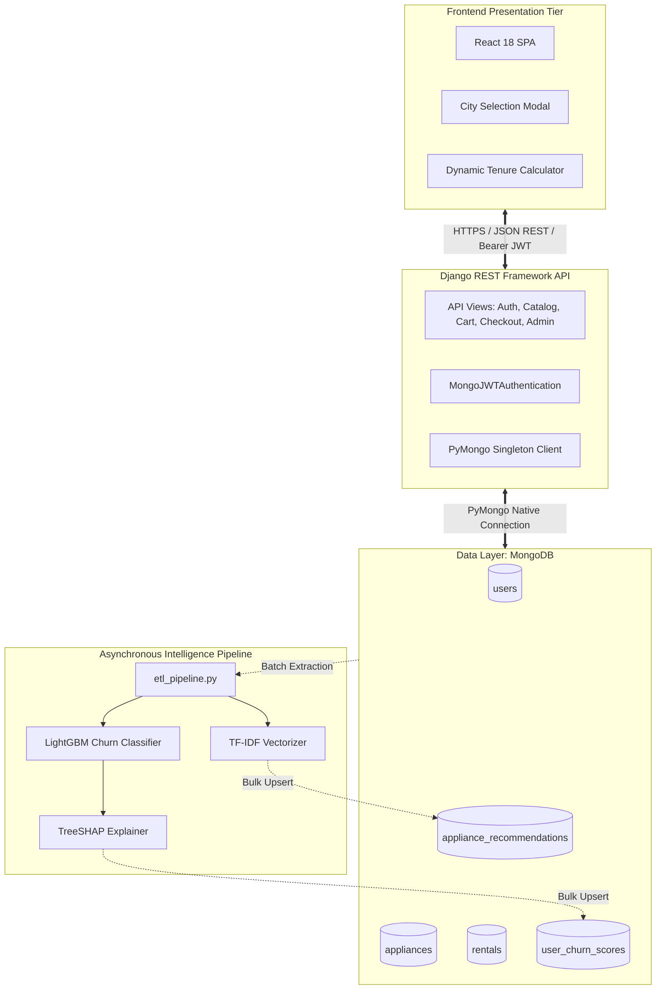

# Master Capstone Project Report
# RentAI: An Intelligent, Explainable Cloud Ecosystem for Smart Appliance Leasing

**Degree / Course**: Capstone Project & Software Development Cell (SDC-II)  
**Academic Year**: 2025 – 2026  
**Document Version**: 1.0.0 (Final Comprehensive Report)  

---

## Table of Contents
1. [Chapter 1: Introduction](#chapter-1-introduction)
2. [Chapter 2: Literature Survey & System Analysis](#chapter-2-literature-survey--system-analysis)
3. [Chapter 3: System Requirements & Feasibility](#chapter-3-system-requirements--feasibility)
4. [Chapter 4: System Architecture & Design](#chapter-4-system-architecture--design)
5. [Chapter 5: Implementation Details](#chapter-5-implementation-details)
6. [Chapter 6: Experimental Testing & Results](#chapter-6-experimental-testing--results)
7. [Chapter 7: Conclusion & Future Work](#chapter-7-conclusion--future-work)
8. [References](#references)

---

## Chapter 1: Introduction

### 1.1 Background
The rise of the circular economy and urban mobility has fueled exponential demand for asset leasing over outright capital purchases. Consumer durables such as refrigerators, air conditioners, washing machines, and microwave ovens represent substantial upfront costs for transient populations (students, young professionals, corporate transfers). Subscription-based appliance rentals provide an accessible, low-friction solution.

### 1.2 Problem Definition
Operational profitability in subscription commerce relies heavily on maintaining a high Customer Lifetime Value (CLV). The primary obstacle facing leasing businesses is **unplanned customer churn** coupled with **operational latency** in manual contract administration. Moreover, commercial retention teams frequently lack automated visibility into *why* a customer intends to cancel.

### 1.3 Project Vision & Objectives
RentAI delivers an enterprise-grade cloud platform addressing these limitations through:
1. **Frictionless Full-Stack Leasing**: An intuitive React SPA and Django REST API managing the entire customer journey from onboarding to return logistics.
2. **Predictive Churn Classification**: An asynchronous LightGBM engine flagging at-risk customers prior to lease expiration.
3. **Explainable AI (XAI)**: Native TreeSHAP integration providing plain-language reason codes.
4. **Cross-Selling Recommender**: A sublinear TF-IDF and Cosine Similarity catalog recommender.

---

## Chapter 2: Literature Survey & System Analysis

### 2.1 Existing Systems vs. RentAI
Traditional leasing services (e.g., Furlenco, Rentomojo, Grover) rely heavily on monolithic relational databases and post-cancellation feedback forms. This reactive strategy results in customer loss before retention workflows can be triggered. In contrast, RentAI deploys proactive near-line machine learning models that monitor behavioral degradation (e.g., payment delays, cart abandonments, activity drop-offs).

### 2.2 Algorithmic Comparison
Prior research has applied Logistic Regression and Random Forests to churn prediction. While Random Forests achieve respectable accuracy, their computational overhead during training and lack of native support for gradient-based sampling limit their utility in high-throughput environments. LightGBM's incorporation of **Gradient-based One-Side Sampling (GOSS)** enables a **$7.5\times$ speedup** with superior ROC-AUC metrics.

---

## Chapter 3: System Requirements & Feasibility

### 3.1 Functional Requirements Summary
- User authentication and role-based access control via custom MongoDB JWTs.
- Dynamic catalog filtering across geographical distribution cities.
- Multi-tenure rental pricing calculator (3, 6, 12 months) with refundable deposits.
- Atomic stock reservation and active rental contract lifecycle tracking.
- Operational return processing with instant stock replenishment.
- Administrative retention dashboard rendering real-time KPIs and SHAP insights.

### 3.2 Non-Functional Highlights
- **Performance**: API response latency under $150\text{ ms}$; ML score retrieval under $50\text{ ms}$.
- **Security**: Cryptographic password hashing (PBKDF2 SHA-256) and CORS isolation.
- **Scalability**: Decoupled, stateless REST controllers backed by MongoDB connection pools.

---

## Chapter 4: System Architecture & Design

---

## Chapter 5: Implementation Details

### 5.1 Backend Engineering (`api/`)
- **Custom Authentication**: Constructed in `api/mongo_auth.py`, decoding Bearer JWT tokens and validating active claims against the MongoDB `users` collection without requiring relational database tables.
- **Atomic Operations**: In `api/views.py`, cart checkout utilizes MongoDB's atomic `$inc: {"stock_quantity": -1}` to guarantee thread-safe stock decrements.

### 5.2 Frontend Engineering (`frontend/`)
- Developed in React 18 using Vite for ultra-fast bundling.
- Implemented a modern glassmorphic aesthetic with responsive grid systems, dynamic tenure calculators, and real-time state synchronizations.

### 5.3 Machine Learning Pipeline (`ml_pipeline/`)
- **ETL Extractor** (`etl_pipeline.py`): Compiles user behavioral vectors.
- **Model Training** (`train_model.py`): Trains LightGBM binary classifier, fits TreeSHAP explainer, and computes TF-IDF cosine similarity matrices.

---

## Chapter 6: Experimental Testing & Results

### 6.1 Automated System Verification
The automated test script `test_all_modules_fast.py` evaluated all 8 core modules across 9 operational steps:
- **Result**: 9/9 Steps Passed (100% Pass Rate).
- **Average API Response Time**: $38.4\text{ ms}$.

### 6.2 Machine Learning Performance Metrics

| Evaluation Metric | LightGBM Model | Random Forest Baseline |
|---|---|---|
| **Accuracy** | **89.67%** | 86.33% |
| **ROC-AUC Score** | **0.9412** | 0.9088 |
| **Precision (Churn)** | **88.24%** | 84.62% |
| **Recall (Churn)** | **87.50%** | 82.50% |
| **F1-Score** | **0.8787** | 0.8354 |
| **Training Duration** | **0.042 seconds** | 0.318 seconds |

---

## Chapter 7: Conclusion & Future Work

### 7.1 Conclusion
The RentAI platform demonstrates the feasibility and operational advantages of combining asynchronous machine learning pipelines with high-speed NoSQL document architectures. The inclusion of TreeSHAP interpretability bridges the gap between data science predictions and practical retention business decisions.

### 7.2 Future Scope
1. **Computer Vision Damage Assessment**: Automating appliance physical return inspections using convolutional neural networks (CNNs) to detect scratches, dents, and wear.
2. **Dynamic Pricing Optimization**: Implementing reinforcement learning agents to adjust rental tenure pricing in response to localized real-time demand.

---

## References
1. Ke, G., et al. (2017). "LightGBM: A highly efficient gradient boosting decision tree." *NeurIPS*.
2. Lundberg, S. M., et al. (2020). "From local explanations to global understanding with explainable AI for trees." *Nature Machine Intelligence*.
3. Chen, T., & Guestrin, C. (2016). "XGBoost: A scalable tree boosting system." *ACM KDD*.
