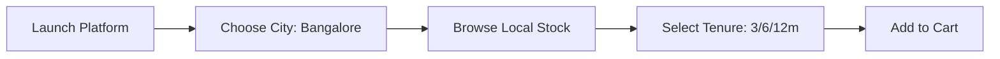
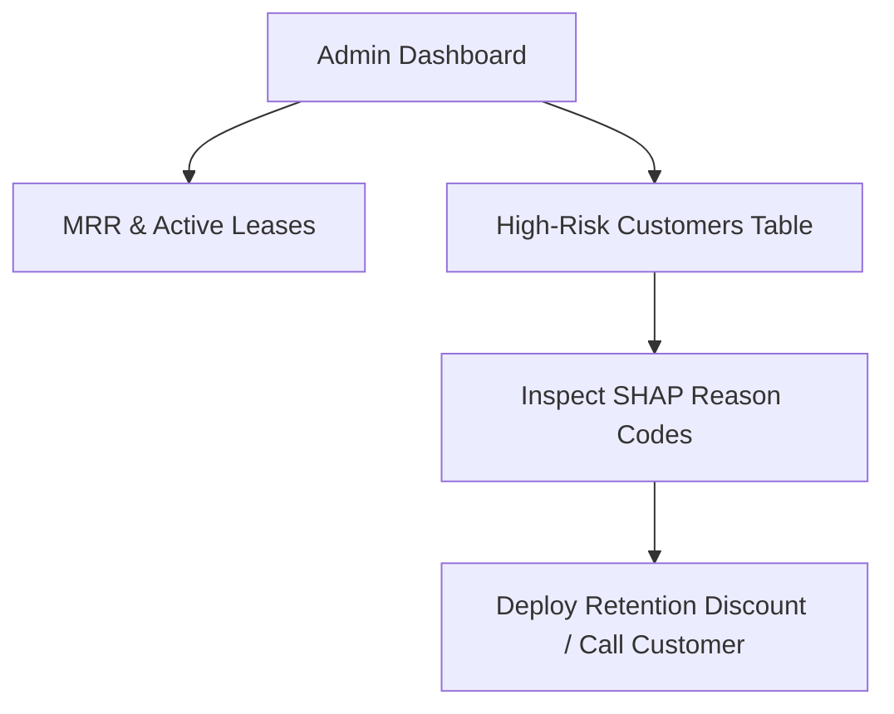

# User Manual & Operations Guide
## Project: Rentora – Smart Appliance Rental Platform
**Audience**: End-User Customers, Operations Staff, and Platform Administrators  
**Version**: 1.0.0  

---

## 1. Introduction

Welcome to **Rentora**, a smart cloud platform for leasing premium home appliances on flexible monthly terms. This guide provides step-by-step instructions for both **Customers** leasing appliances and **Administrators** managing platform retention and inventory.

---

## 2. Customer User Guide

### 2.1 Account Creation & Authentication
1. **Accessing the Portal**: Navigate to `http://localhost:5173` in your web browser.
2. **Registration**: Click **Sign Up** in the navigation header. Provide your `Username`, `Email Address`, `Phone Number`, and create a password.
3. **Login**: Enter your registered email and password to receive an authenticated session token.

### 2.2 Selecting Your Operational City
Rentora operates specialized logistics hubs across major metropolitan regions:
- Upon initial visit, a **City Selection Modal** will appear.
- Select your city (e.g. *Bangalore*, *Mumbai*, *Delhi*, *Hyderabad*).
- The catalog automatically filters to display appliances available in your selected hub.

### 2.3 Exploring the Catalog & Choosing Rental Tenures
1. **Category Navigation**: Filter products using category tabs (*Refrigerators*, *Washing Machines*, *Microwaves*, *Air Conditioners*).
2. **Tenure Pricing Calculator**: Each product card features interactive tenure buttons (`3 Months`, `6 Months`, `12 Months`):
   - Longer tenures offer discounted monthly rates.
   - Refundable security deposits are displayed clearly upfront.
3. **Product Specifications**: Click on any product card to view detailed specifications, dimensions, power consumption ratings, and high-resolution photo galleries.

### 2.4 Shopping Cart & Checkout
1. Click **Add to Cart** with your chosen rental tenure.
2. Open the **Cart Drawer** on the top right to review your selected appliances, monthly rental fees, and refundable deposits.
3. Complete **KYC Verification**: Upload your government identity document (Aadhaar / Driving License) for instant verification.
4. Provide your delivery address and click **Confirm & Lease Now**.
5. Your contract will transition immediately to **ACTIVE** status.

### 2.5 Managing Active Contracts & Initiating Returns
- Visit the **My Rentals** dashboard to inspect active leases, next billing dates, and contract expiration timelines.
- To end a lease, click **Request Return** next to the appliance. Our logistics team will schedule an inspection pickup, after which your deposit is refunded and the contract is marked **RETURNED**.

---

## 3. Administrator Operations Guide

### 3.1 Accessing the Admin Retention Dashboard
- Log in using an account with the `admin` role.
- Navigate to the **Admin Control Center** (`/admin/dashboard`).

### 3.2 Executive Metrics & Revenue Tracking
The dashboard renders high-level operational key performance indicators (KPIs):
- **Total Users**: Total registered customer accounts.
- **Active Rentals**: Appliances currently on active leases.
- **Monthly Recurring Revenue (MRR)**: Gross monthly subscription billings.
- **High-Risk Churn Count**: Subscribers flagged by the machine learning pipeline.

### 3.3 Interpreting SHAP Reason Codes for Customer Retention
The platform's **Predictive Churn Engine** ranks subscribers by their attrition risk. Instead of an ambiguous percentage, each entry provides an interpretable **SHAP Reason Code**:

| Displayed SHAP Reason | Underlying Behavioral Trigger | Recommended Retention Action |
|---|---|---|
| *"High frequency of delayed payments"* | $\ge 2$ late payment strikes | Offer flexible payment split or grace period |
| *"Premature appliance returns detected"* | History of early lease cancellations | Inquire about appliance performance or offer upgrade |
| *"Over 20+ days of platform inactivity"* | Inactivity drop-off | Send re-engagement notification with renewal bonus |
| *"Low user satisfaction rating reported"* | Review rating $\le 2.0$ | Direct proactive customer support intervention |

---

## 4. Frequently Asked Questions (FAQ)

**Q: Are security deposits refundable?**  
A: Yes, $100\%$ of the security deposit is refunded to your original payment method once the appliance is returned and inspected.

**Q: Can I extend my rental tenure after checkout?**  
A: Yes. You can navigate to **My Rentals** and upgrade your tenure to a longer tier to unlock lower monthly rates.

**Q: What cities are currently supported?**  
A: Bangalore, Mumbai, Delhi-NCR, and Hyderabad. Additional distribution hubs are added quarterly.
