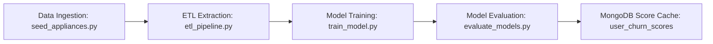

# Technical Documentation & Developer Guide
## Project: Rentora – Smart Appliance Rental Platform
**Target Audience**: Software Engineers, DevOps Engineers, and Data Scientists  
**Version**: 1.0.0  

---

## 1. System Prerequisites & Development Setup

### 1.1 Core Requirements
- **Python**: Version `3.10` or `3.11`
- **Node.js**: Version `18.x` or `20.x` (LTS) & `npm 9+`
- **Database**: MongoDB Community Server `6.0+` (Running locally on default port `27017` or MongoDB Atlas URI)
- **Operating System**: Linux (Ubuntu 20.04/22.04), macOS, or Windows 10/11

---

## 2. Step-by-Step Installation & Local Execution

### 2.1 Backend Environment Configuration
Clone the repository and initialize the Python virtual environment:

```bash
# Clone the repository
git clone https://github.com/your-org/Rentora.git
cd Rentora

# Create and activate virtual environment
python -m venv venv

# On Windows:
.\venv\Scripts\activate
# On Linux / macOS:
source venv/bin/activate

# Install Python dependencies
pip install -r requirements.txt
```

### 2.2 Database Initialization & Seeding
Ensure MongoDB daemon is running (`mongod --dbpath <data_dir>`). Then populate sample appliance catalogs:

```bash
# Execute catalog seeding scripts
python seed_appliances.py
python ingest_electronics.py
```

### 2.3 Starting the Django Backend Server
Run database migrations (for Django admin internal sessions) and launch the server:

```bash
python manage.py migrate
python manage.py runserver 127.0.0.1:8000
```
The REST API will be accessible at: `http://127.0.0.1:8000/api/`

### 2.4 Launching the React Frontend SPA
Open a separate terminal window and start the Vite dev server:

```bash
cd frontend
npm install
npm run dev
```
The frontend interface will be live at: `http://localhost:5173`

---

## 3. Machine Learning Pipeline Execution

The machine learning subsystem operates asynchronously to prepare recommendations and churn risk assessments:



### 3.1 Training LightGBM & Pre-computing Recommendations
```bash
python ml_pipeline/train_model.py
```
This script:
1. Fits the LightGBM model on customer behavioral records.
2. Extracts TreeSHAP values and formats human-readable reason strings.
3. Vectorizes catalog text using TF-IDF and builds pairwise cosine matrices.
4. Bulk-writes results to MongoDB collections `user_churn_scores` and `appliance_recommendations`.

### 3.2 Running Performance & Accuracy Benchmarks
```bash
python ml_pipeline/evaluate_models.py
```
Outputs classification reports, confusion matrices, ROC-AUC comparisons, and execution timings.

---

## 4. Automated Full-Stack Verification

To verify that all backend endpoints, authentication flows, catalog queries, cart mechanics, checkout transactions, asset returns, and admin dashboards are functioning properly, execute the test suite:

```bash
python test_all_modules_fast.py
```

The script runs 9 atomic checkpoints and outputs real-time results:
```
============================================================================
  RENTORA FULL-STACK SYSTEM VERIFICATION (FAST AGENT)
============================================================================
[PASSED]   Step 0  | System Architecture            | Frontend (Vite :5173) Health
[PASSED]   Step 1  | Module 1: User Auth & Profile  | Customer Registration
[PASSED]   Step 2  | Module 1: User Auth & Profile  | Custom JWT Token Issuance
[PASSED]   Step 3  | Module 2: Catalog Inventory    | Multi-City Filtering (Bangalore)
[PASSED]   Step 4  | Module 7: Recommender Engine   | Personalized Recs
[PASSED]   Step 5  | Module 3: Cart Engine          | Cart Modification & Tenure Calc
[PASSED]   Step 6  | Module 3: Booking Engine       | Atomic Checkout & Stock Decrement
[PASSED]   Step 7  | Module 4: Payment & Return     | Asset Return & Stock Replenishment
[PASSED]   Step 8  | Module 8: Admin Analytics      | Retention Dashboard & SHAP Codes
```

---

## 5. Source Tree and Architecture Map

| File / Folder | Primary Responsibility |
|---|---|
| `api/mongo_client.py` | Thread-safe Singleton MongoDB client connection pool. |
| `api/mongo_auth.py` | Custom stateless JWT authentication strategy verifying MongoDB tokens. |
| `api/views.py` | REST API controllers handling Auth, Catalog, Cart, Checkout, Rentals, and Admin. |
| `api/urls.py` | URL route definitions mapping endpoints to APIViews. |
| `rentora_core/settings.py` | Core Django configuration, CORS settings, and MongoDB connection URIs. |
| `ml_pipeline/etl_pipeline.py` | Behavioral feature transformation and aggregation logic. |
| `ml_pipeline/train_model.py` | Core ML training harness for LightGBM, SHAP, and TF-IDF. |
| `ml_pipeline/evaluate_models.py` | Statistical evaluation script comparing models and benchmarking metrics. |
| `test_all_modules_fast.py` | Automated end-to-end integration and smoke test runner. |
