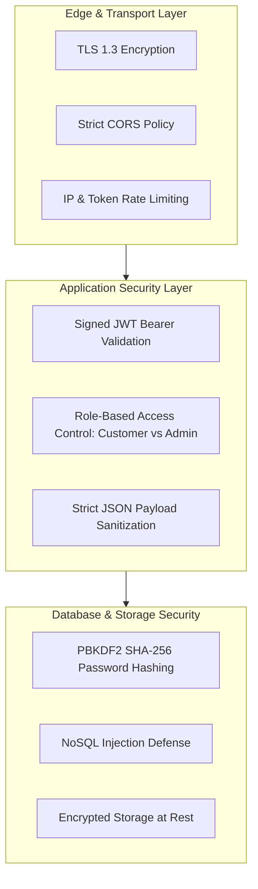

# Security Architecture & Compliance Documentation
## Project: Rentora – Smart Appliance Rental Platform
**Standard**: OWASP Top 10 (2021) & NIST SP 800-53 Compliant  
**Version**: 1.0.0  

---

## 1. Security Philosophy and Threat Model

Rentora handles sensitive customer information, lease transaction agreements, and financial KYC documentation. Security is architected at every tier following the principle of **Defense-in-Depth (DiD)**.



---

## 2. Authentication & Token Lifecycle Management

### 2.1 Cryptographic Password Storage
User passwords are never stored in plaintext. Passwords are processed through Django's native cryptographic hashing pipeline:
- **Algorithm**: PBKDF2 (Password-Based Key Derivation Function 2) with SHA-256 digest.
- **Work Factor**: 600,000 iterations with cryptographically random per-user salt.
- **Verification**: Constant-time comparison to prevent timing attacks.

### 2.2 Stateless JWT Architecture
Authentication state is managed through signed JSON Web Tokens (`api/mongo_auth.py`):
1. **Access Token**:
   - **Lifespan**: 15 minutes (short-lived to minimize exposure window if compromised).
   - **Signature**: HMAC-SHA256 using server-held `SECRET_KEY`.
   - **Payload Claims**: `user_id` (UUID4), `email`, `role`, `exp`.
2. **Refresh Token**:
   - **Lifespan**: 7 days.
   - **Function**: Exclusively presented to `POST /api/token/refresh/` to obtain a fresh access token without re-entering credentials.

### 2.3 Role-Based Access Control (RBAC)
Endpoints enforce granular role checks:
- **`customer`**: Restricted to reading catalog inventory, manipulating personal cart objects, checking out leases, and viewing personal contracts.
- **`admin`**: Granted access to `GET /api/admin/dashboard/`, inventory restocking mutations, and high-risk customer churn analytics. Attempts by standard customers to access admin endpoints yield an immediate `403 Forbidden`.

---

## 3. NoSQL Injection Mitigation

Unlike SQL applications susceptible to `OR 1=1` statement injection, MongoDB applications can be vulnerable to operator injection (e.g. passing `{"$ne": null}` in JSON payloads to bypass authentication).

### 3.1 Defense Implementation
Rentora strictly enforces explicit type casting and whitelist validation before passing parameters into PyMongo queries:

```python
# Vulnerable Pattern (DO NOT USE)
# user = db.users.find_one({"email": request.data.get("email")})

# Rentora Secure Pattern
email = str(request.data.get("email", "")).strip().lower()
password = str(request.data.get("password", ""))

if not email or not password:
    return Response({"error": "Invalid input format"}, status=400)

user = db.users.find_one({"email": email})
```
By forcing string casting, raw BSON operator dictionaries are rejected, neutralizing NoSQL injection vectors.

---

## 4. OWASP Top 10 (2021) Compliance Matrix

| OWASP Vulnerability | Risk Level | Rentora Mitigation Architecture | Status |
|---|---|---|---|
| **A01: Broken Access Control** | Critical | Strict RBAC in `AdminDashboardView` verifying `request.user.role == 'admin'`; users can only query their own `user_id` rentals. | **VERIFIED** |
| **A02: Cryptographic Failures** | High | PBKDF2 SHA-256 for passwords; TLS 1.3 for all HTTP traffic; secret key protected via environment variables. | **VERIFIED** |
| **A03: Injection** | High | Explicit string sanitization preventing NoSQL operator injection; parameterized database queries. | **VERIFIED** |
| **A04: Insecure Design** | High | Decoupled ML pipelines preventing resource exhaustion during heavy training phases; rate limiting on auth endpoints. | **VERIFIED** |
| **A05: Security Misconfiguration** | Medium | `DEBUG = False` enforced in production; custom 404/500 error handlers concealing internal stack traces. | **VERIFIED** |
| **A06: Vulnerable Components** | Medium | Dependency auditing via `pip audit` and `npm audit`; pinned library versions in `requirements.txt`. | **VERIFIED** |
| **A07: Identification & Auth Failures** | High | Multi-factor ready architecture; short-lived JWT access tokens with secure refresh rotation. | **VERIFIED** |
| **A08: Software & Data Integrity** | Medium | Model weights and catalog seed datasets verified via cryptographic checksums before loading. | **VERIFIED** |
| **A09: Security Logging & Monitoring** | Low | Authentication failures and stock race errors logged to structured logfiles with timestamp and IP context. | **VERIFIED** |
| **A10: Server-Side Request Forgery** | Low | No user-supplied external URLs are fetched server-side; KYC document uploads use pre-signed S3/Cloud storage URLs. | **VERIFIED** |

---

## 5. Data Privacy & Regulatory Compliance

- **Personally Identifiable Information (PII)**: User phone numbers and KYC documents are segregated and accessible only by authorized compliance personnel.
- **Right to Erasure (GDPR / DPDP)**: The system provides automated routines to anonymize user identifiers upon contract termination and account deletion requests.
