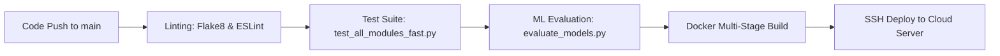

# Production Deployment & DevOps Guide
## Project: RentAI – Smart Appliance Rental Platform
**Target Environment**: Linux (Ubuntu 22.04 LTS) / Cloud Infrastructure (AWS / GCP / DigitalOcean)  
**Containerization**: Docker & Docker Compose  
**Reverse Proxy**: Nginx 1.24+ with SSL / TLS 1.3  
**Version**: 1.0.0  

---

## 1. Production Architecture Overview

The production deployment of RentAI is designed for high availability, sub-150ms response latency, and complete decoupling of transactional web traffic from background analytical computing.

```mermaid
graph TD
    Internet((Internet / HTTPS)) -->|Port 443| Nginx[Nginx Reverse Proxy & SSL Termination]
    
    subgraph FrontendStatic [Static Assets]
        Nginx -->|Serve /dist| StaticSPA[Compiled React 18 SPA]
    end

    subgraph BackendCluster [Application Tier]
        Nginx -->|Proxy Pass /api/| Gunicorn[Gunicorn WSGI Workers (4x)]
        Gunicorn --> DjangoApp[Django 5.2 Application]
    end

    subgraph DatabaseCluster [Persistence Tier]
        DjangoApp -->|Connection Pool| Mongo[(MongoDB Cluster / Replica Set)]
    end

    subgraph MLOpsWorker [Asynchronous Analytical Worker]
        Cron[Systemd Cron / Worker] -->|Scheduled ETL & Model Fit| MLScript[ml_pipeline/train_model.py]
        MLScript -->|Batch Sync Scores| Mongo
    end
```

---

## 2. Docker Containerization

### 2.1 Multi-Stage Dockerfile for React Frontend (`frontend/Dockerfile`)
```dockerfile
# Stage 1: Build the React Application
FROM node:20-alpine AS build
WORKDIR /app
COPY package*.json ./
RUN npm ci
COPY . .
RUN npm run build

# Stage 2: Serve with Lightweight Nginx
FROM nginx:alpine
COPY --from=build /app/dist /usr/share/nginx/html
COPY nginx.conf /etc/nginx/conf.d/default.conf
EXPOSE 80
CMD ["nginx", "-g", "daemon off;"]
```

### 2.2 Production Dockerfile for Django API (`Dockerfile.backend`)
```dockerfile
FROM python:3.11-slim
ENV PYTHONDONTWRITEBYTECODE=1
ENV PYTHONUNBUFFERED=1

WORKDIR /app

RUN apt-get update && apt-get install -y --no-install-recommends \
    build-essential \
    libgomp1 \
    && rm -rf /var/lib/apt/lists/*

COPY requirements.txt .
RUN pip install --no-cache-dir -r requirements.txt gunicorn

COPY . .

EXPOSE 8000
CMD ["gunicorn", "--bind", "0.0.0.0:8000", "--workers", "4", "--timeout", "60", "rentai_core.wsgi:application"]
```

### 2.3 Docker Compose Orchestration (`docker-compose.yml`)
```yaml
version: '3.8'

services:
  mongodb:
    image: mongo:6.0
    container_name: rentai_mongodb
    restart: always
    environment:
      MONGO_INITDB_DATABASE: rentai_db
    volumes:
      - mongo_data:/data/db
    ports:
      - "27017:27017"

  backend:
    build:
      context: .
      dockerfile: Dockerfile.backend
    container_name: rentai_backend
    restart: always
    environment:
      - MONGO_URI=mongodb://mongodb:27017/
      - MONGO_DB_NAME=rentai_db
      - SECRET_KEY=${SECRET_KEY}
      - DEBUG=False
    depends_on:
      - mongodb
    ports:
      - "8000:8000"

  frontend:
    build:
      context: ./frontend
      dockerfile: Dockerfile
    container_name: rentai_frontend
    restart: always
    ports:
      - "80:80"
    depends_on:
      - backend

volumes:
  mongo_data:
```

---

## 3. Nginx Reverse Proxy Configuration

```nginx
# /etc/nginx/sites-available/rentai.conf
server {
    listen 80;
    server_name rentai.example.com;
    return 301 https://$host$request_uri;
}

server {
    listen 443 ssl http2;
    server_name rentai.example.com;

    ssl_certificate /etc/letsencrypt/live/rentai.example.com/fullchain.pem;
    ssl_certificate_key /etc/letsencrypt/live/rentai.example.com/privkey.pem;
    ssl_protocols TLSv1.2 TLSv1.3;
    ssl_ciphers HIGH:!aNULL:!MD5;

    # Frontend Single Page App Routing
    location / {
        root /var/www/rentai/frontend/dist;
        try_files $uri $uri/ /index.html;
        expires 7d;
        add_header Cache-Control "public, no-transform";
    }

    # API Proxy Routing
    location /api/ {
        proxy_pass http://127.0.0.1:8000;
        proxy_set_header Host $host;
        proxy_set_header X-Real-IP $remote_addr;
        proxy_set_header X-Forwarded-For $proxy_add_x_forwarded_for;
        proxy_set_header X-Forwarded-Proto $scheme;
        proxy_read_timeout 60s;
    }
}
```

---

## 4. Continuous Integration & Deployment (CI/CD Pipeline)

Automated GitHub Actions workflow (`.github/workflows/deploy.yml`):



### GitHub Actions Pipeline Configuration
```yaml
name: RentAI CI/CD Pipeline

on:
  push:
    branches: [ main ]

jobs:
  verify-and-test:
    runs-on: ubuntu-latest
    services:
      mongodb:
        image: mongo:6.0
        ports:
          - 27017:27017
    steps:
      - uses: actions/checkout@v3

      - name: Set up Python 3.11
        uses: actions/setup-python@v4
        with:
          python-version: "3.11"

      - name: Install Dependencies
        run: |
          pip install -r requirements.txt
          pip install flake8 pytest

      - name: Run Backend Seed & ML Checks
        run: |
          python seed_appliances.py
          python ml_pipeline/evaluate_models.py

      - name: Execute Full Integration Harness
        run: |
          python manage.py migrate
          python manage.py runserver 127.0.0.1:8000 &
          sleep 3
          python test_all_modules_fast.py
```

---

## 5. Database Backup and Disaster Recovery Strategy

To prevent data loss, automated MongoDB snapshot backups are executed via daily cron jobs:

```bash
#!/bin/bash
# /opt/scripts/backup_mongodb.sh
BACKUP_DIR="/var/backups/mongodb"
TIMESTAMP=$(date +"%Y%m%d_%H%M%S")

mkdir -p "$BACKUP_DIR"
mongodump --db=rentai_db --gzip --archive="$BACKUP_DIR/rentai_db_$TIMESTAMP.gz"

# Retain last 14 days of snapshots
find "$BACKUP_DIR" -type f -name "*.gz" -mtime +14 -exec rm {} \;
```

---

## 6. System Health Monitoring and Alerting

1. **Uptime SLA**: Monitored continuously via external synthetic HTTP pings to `/api/appliances/`.
2. **ML Model Drift Monitoring**: Monthly evaluation of prediction error distributions; if the model's test ROC-AUC drops below $0.85$, automated alerts trigger hyperparameter retraining.
