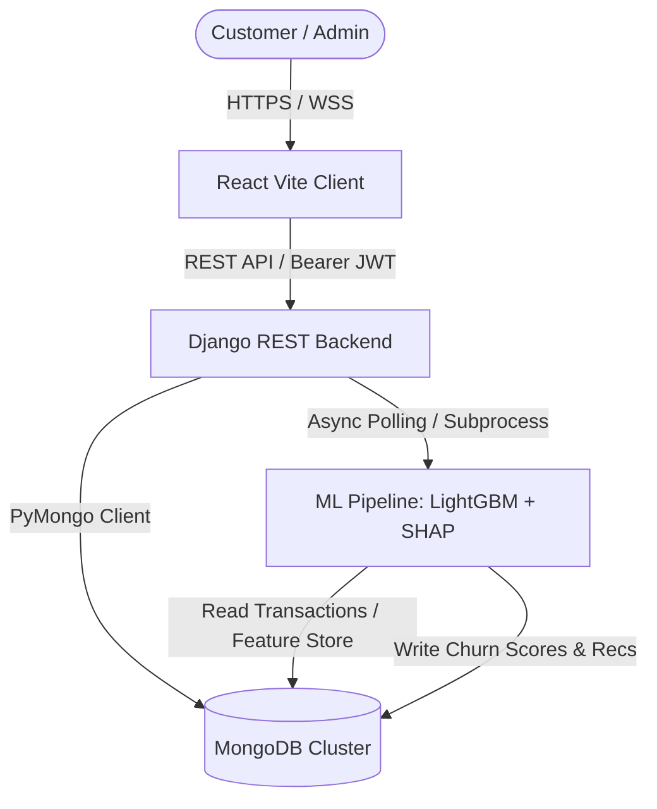

# Software Requirements Specification (SRS)
## Project: Rentora – Smart Appliance Rental Platform
**Standard**: IEEE Std 830-1998 Compliant  
**Version**: 1.0.0  
**Status**: Approved & Baselined  

---

## 1. Introduction

### 1.1 Purpose
This Software Requirements Specification (SRS) establishes the complete functional and non-functional requirements for the **Rentora** platform. Rentora is an AI-powered smart appliance rental platform that automates customer lifecycle management, inventory logistics, flexible tenure leasing, and predictive retention analytics using machine learning.

### 1.2 Scope of the System
Rentora provides a full-stack, distributed web platform delivering:
1. Flexible tenure-based appliance rentals (3, 6, 12+ months) across multi-city distribution hubs.
2. Frictionless customer onboarding, profile management, and KYC validation.
3. Cart configuration, payment recording, and automated contract state machine.
4. Explainable AI churn prediction for administrative retention operations.
5. High-speed collaborative and content-based recommendation engines for personalized cross-selling.

### 1.3 Definitions, Acronyms, and Abbreviations
- **SRS**: Software Requirements Specification
- **JWT**: JSON Web Token
- **NoSQL**: Non-relational database management system (specifically MongoDB)
- **ETL**: Extract, Transform, Load data pipeline
- **LightGBM**: Light Gradient Boosting Machine
- **SHAP**: SHapley Additive exPlanations
- **KYC**: Know Your Customer identity verification
- **RBAC**: Role-Based Access Control

### 1.4 References
- IEEE Std 830-1998: IEEE Recommended Practice for Software Requirements Specifications.
- ISO/IEC 25010: Systems and software engineering — Systems and software Quality Requirements and Evaluation (SQuaRE).
- Rentora Architecture Document (`ARCHITECTURE.md`).

---

## 2. Overall Description

### 2.1 Product Perspective
Rentora operates as a cloud-native, three-tier client-server application:
- **Presentation Tier**: Vite + React 18 single-page application (SPA).
- **Application & API Tier**: Django 5.2 + Django REST Framework exposing stateless JSON REST endpoints.
- **Data & Intelligence Tier**: MongoDB NoSQL cluster + Asynchronous Python ML Pipeline.

### 2.2 User Classes and Characteristics
1. **Unauthenticated Visitor**: Can browse appliance catalog, filter by city and category, view rental tenure prices and specifications.
2. **Authenticated Customer**: Can manage user profile, submit KYC documents, configure active carts, execute lease checkouts, view active contracts, and initiate returns.
3. **Operations & Admin Manager**: Has elevated privileges to inspect platform revenue metrics, view customer churn risk scores with SHAP explanations, and manage appliance inventory.

### 2.3 Operating Environment
- **Server OS**: Linux (Ubuntu 22.04 LTS / Debian 12) or Windows 10/11 Server.
- **Application Runtime**: Python 3.10+ and Node.js 18+ (LTS).
- **Database Engine**: MongoDB Community Server 6.0+ / MongoDB Atlas.
- **Client Browsers**: Modern Evergreen Browsers (Chrome 100+, Firefox 98+, Safari 15+, Edge 100+).

### 2.4 Design and Implementation Constraints
- High-concurrency operations require asynchronous analytical pipelines so operational database reads/writes are never blocked.
- Authentication must adhere to cryptographically signed JWT standards without storing passwords in plaintext.
- The user interface must comply with responsive glassmorphic design standards and WCAG 2.1 AA accessibility guidelines.

---

## 3. Specific Functional Requirements

### 3.1 Module 1: User Identity & Authentication (FR-AUTH)
- **FR-AUTH-01**: The system shall allow users to register with `username`, `email`, `password`, `phone_num`, and `role`.
- **FR-AUTH-02**: Passwords shall be hashed using Django's PBKDF2 with SHA-256 before persisting to MongoDB.
- **FR-AUTH-03**: The system shall issue a signed JWT Access Token (15-minute expiry) and Refresh Token (7-day expiry) upon valid credentials.
- **FR-AUTH-04**: The system shall validate token authenticity on protected endpoints and handle graceful token refreshes.

### 3.2 Module 2: Appliance Catalog & Inventory (FR-CAT)
- **FR-CAT-01**: The system shall maintain appliances with attributes: `rental_name`, `category_id`, `daily_price`, `stock_quantity`, `description`, `images`, `available_cities`, and `tenure_pricing` (3, 6, 12 months).
- **FR-CAT-02**: Users shall be able to filter products by `category`, `city`, price ranges, and search keywords.
- **FR-CAT-03**: Real-time stock availability check shall block rental if `stock_quantity <= 0`.

### 3.3 Module 3: Cart & Multi-Tenure Checkout (FR-ORD)
- **FR-ORD-01**: Users shall be able to add appliances to a persistent cart specifying rental tenure (e.g. 3, 6, or 12 months).
- **FR-ORD-02**: Checkout shall validate inventory availability atomically and generate an active `Rental` record.
- **FR-ORD-03**: Upon checkout, the appliance `stock_quantity` shall decrease by 1.

### 3.4 Module 4: Active Contracts & Returns (FR-RET)
- **FR-RET-01**: Users shall be able to view their active rentals with start date, calculated end date, monthly fee, and live status.
- **FR-RET-02**: Users can initiate an early or scheduled appliance return.
- **FR-RET-03**: Upon contract termination, the system records `returned_at` and restores appliance `stock_quantity` in MongoDB.

### 3.5 Module 5: KYC Verification (FR-KYC)
- **FR-KYC-01**: Authenticated customers shall be able to submit identity proof documents (e.g. Government ID, Address proof).
- **FR-KYC-02**: Verification status (`PENDING`, `VERIFIED`, `REJECTED`) shall be attached to user profiles.

### 3.6 Module 6: Predictive Churn Engine (FR-ML-CHURN)
- **FR-ML-CHURN-01**: The system shall execute an automated pipeline computing behavioral risk scores for all active customers.
- **FR-ML-CHURN-02**: Churn risk scores shall range between $0.00$ and $1.00$.
- **FR-ML-CHURN-03**: Every churn risk score shall include interpretable SHAP reason codes explaining the primary drivers of churn risk (e.g. *"High late payment frequency"*, *"Prolonged inactivity"*).

### 3.7 Module 7: Personalized Recommendation Engine (FR-ML-REC)
- **FR-ML-REC-01**: The system shall compute collaborative and content-based similarity scores between user rental history and catalog products.
- **FR-ML-REC-02**: The top-5 personalized appliance recommendations shall be delivered via `/api/recommendations/` with sub-100ms response time.

### 3.8 Module 8: Executive Admin Analytics (FR-ADM)
- **FR-ADM-01**: The admin dashboard shall display aggregate platform statistics: Total Users, Active Rentals, Gross Monthly Revenue, Average Churn Rate.
- **FR-ADM-02**: Admin users shall inspect high-risk customers, their risk percentage, and actionable retention suggestions.

---

## 4. Non-Functional Requirements (NFR)

### 4.1 Performance & Latency
- **NFR-PERF-01**: Catalog browse and product search API responses shall complete within $\le 150 \text{ ms}$ under 500 concurrent users.
- **NFR-PERF-02**: Recommendation and Churn score retrieval endpoints shall execute in $\le 50 \text{ ms}$ by leveraging pre-computed MongoDB collections.

### 4.2 Scalability & Reliability
- **NFR-SCAL-01**: The system shall scale horizontally by deploying multiple Django ASGI/WSGI instances behind an Nginx reverse proxy.
- **NFR-SCAL-02**: System uptime SLA shall target $99.9\%$ monthly availability excluding planned maintenance windows.

### 4.3 Security & Data Protection
- **NFR-SEC-01**: All data transmission across public internet shall enforce TLS 1.3.
- **NFR-SEC-02**: The API shall implement CORS filtering and rate limiting (throttling) to guard against brute-force attacks.
- **NFR-SEC-03**: JWT signatures must use HMAC-SHA256 with cryptographically robust secret rotation.

### 4.4 Usability & Maintainability
- **NFR-USE-01**: The user interface shall provide responsive adaptations for Mobile (320px+), Tablet (768px+), and Desktop (1200px+).
- **NFR-MAINT-01**: Codebase shall maintain modular separation between presentation (`frontend`), API gateway (`api`), core configuration (`rentora_core`), and data science (`ml_pipeline`).

---

## 5. Requirements Traceability Matrix (RTM)

| Requirement ID | Module | Implementation File | Verification Method |
|---|---|---|---|
| FR-AUTH-01/03 | Auth | [views.py](file:///c:/Users/dhran/Desktop/Rentora/api/views.py), [mongo_auth.py](file:///c:/Users/dhran/Desktop/Rentora/api/mongo_auth.py) | Automated Integration Test |
| FR-CAT-01/02 | Inventory | [views.py](file:///c:/Users/dhran/Desktop/Rentora/api/views.py) (`ApplianceView`) | API Contract Test |
| FR-ORD-01/03 | Orders | [views.py](file:///c:/Users/dhran/Desktop/Rentora/api/views.py) (`CheckoutView`) | Transaction Integrity Test |
| FR-RET-01/03 | Returns | [views.py](file:///c:/Users/dhran/Desktop/Rentora/api/views.py) (`RentalsView`) | State Machine Unit Test |
| FR-ML-CHURN | ML Pipeline | [train_model.py](file:///c:/Users/dhran/Desktop/Rentora/ml_pipeline/train_model.py), [evaluate_models.py](file:///c:/Users/dhran/Desktop/Rentora/ml_pipeline/evaluate_models.py) | ROC-AUC & F1 Evaluation |
| FR-ML-REC | Recommender | [train_model.py](file:///c:/Users/dhran/Desktop/Rentora/ml_pipeline/train_model.py) | Precision@K Benchmarks |
| FR-ADM-01/02 | Admin | [views.py](file:///c:/Users/dhran/Desktop/Rentora/api/views.py) (`AdminDashboardView`) | End-to-End System Test |
