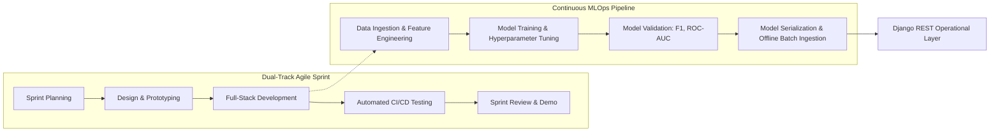

# Software Development Life Cycle (SDLC) Specification
## Project: RentAI – Smart Appliance Rental Platform
**Methodology**: Agile Scrum with MLOps Integration  
**Version**: 1.0.0  

---

## 1. SDLC Methodology Overview

The RentAI platform development follows an adapted **Agile Scrum Framework integrated with Continuous MLOps Lifecycle**. Because the system couples real-time web transactions (Django + React + MongoDB) with offline predictive learning (LightGBM + SHAP + Scikit-Learn), a hybrid engineering cycle was adopted to allow rapid feature iteration while preserving analytical model stability and reproducibility.

---

## 2. SDLC Phases and Deliverables

### Phase 1: Inception, Requirements Analysis & Feasibility
- **Focus**: Stakeholder interviews, market study of existing furniture/appliance leasing portals (e.g. Furlenco, Rentomojo), requirement elicitation, and technical feasibility validation.
- **Key Deliverables**:
  - [Software Requirements Specification (SRS)](file:///c:/Users/dhran/Desktop/RentAI/docs/software/01_SRS.md)
  - [Feasibility Study](file:///c:/Users/dhran/Desktop/RentAI/docs/software/03_FEASIBILITY_STUDY.md)
  - [Project Proposal](file:///c:/Users/dhran/Desktop/RentAI/docs/software/04_PROJECT_PROPOSAL.md)

### Phase 2: System Architecture & Detailed Design
- **Focus**: Decoupled 3-tier architecture, selection of MongoDB for schema flexibility (flexible tenure pricing structures), RESTful API contracts, and UML modeling.
- **Key Deliverables**:
  - [System Design Document](file:///c:/Users/dhran/Desktop/RentAI/docs/software/06_SYSTEM_DESIGN_DOCUMENT.md)
  - [UML Documentation](file:///c:/Users/dhran/Desktop/RentAI/docs/software/07_UML_DOCUMENTATION.md)
  - [Database Design Document](file:///c:/Users/dhran/Desktop/RentAI/docs/software/08_DATABASE_DESIGN_DOCUMENT.md)
  - [API Documentation](file:///c:/Users/dhran/Desktop/RentAI/docs/software/09_API_DOCUMENTATION.md)

### Phase 3: Core Implementation & Prototyping (Iterative Sprints)
- **Sprint 1 (Foundations & Data Store)**: Setting up Django project structure, MongoDB connection pooling (`api/mongo_client.py`), JWT cryptographic engine (`api/mongo_auth.py`), and catalog seed datasets.
- **Sprint 2 (Rental Engine & Cart)**: Cart state persistence, atomic inventory reservation, checkout flow, active contract tracking, and appliance return handlers.
- **Sprint 3 (Frontend SPA & Interactive UI)**: Responsive React 18 interface, City Selection modal, dynamic tenure price calculator, customer dashboard, and KYC upload forms.
- **Sprint 4 (Machine Learning & MLOps)**: Synthetic rental behavioral dataset generator (`evaluate_models.py`), LightGBM churn classification, SHAP tree explainability generation, and TF-IDF catalog vectorizer.
- **Sprint 5 (Admin Analytics & XAI)**: Dedicated administrative analytics portal displaying churn risk rankings, plain-language SHAP indicators, and real-time revenue KPIs.

### Phase 4: Verification, Validation & Testing
- **Focus**: Multi-tier test suite covering automated regression tests, API contract checks, stock concurrency assertions, and ML precision/recall benchmarks.
- **Key Deliverables**:
  - [Test Plan](file:///c:/Users/dhran/Desktop/RentAI/docs/software/11_TEST_PLAN.md)
  - [Test Report](file:///c:/Users/dhran/Desktop/RentAI/docs/software/12_TEST_REPORT.md)
  - Test Harness: `test_all_modules_fast.py`

### Phase 5: Deployment, Monitoring & Maintenance
- **Focus**: Containerization with Docker Compose, Nginx reverse proxy configuration, automated database backup schedules, and model drift monitoring.
- **Key Deliverables**:
  - [Deployment Documentation](file:///c:/Users/dhran/Desktop/RentAI/docs/research/07_DEPLOYMENT_DOCUMENTATION.md)
  - [Security Documentation](file:///c:/Users/dhran/Desktop/RentAI/docs/research/06_SECURITY_DOCUMENTATION.md)

---

## 3. Team Roles and Responsibilities (RACI Matrix)

| Role | Responsibilities | Members / Assignments |
|---|---|---|
| **Product Owner / Project Lead** | Scope definition, sprint backlog prioritization, milestone sign-off | Lead System Architect |
| **Backend Engineer** | Django REST API, MongoDB data drivers, JWT auth, business logic | Core Engineering Team |
| **Frontend Engineer** | React components, Vite configuration, styling & accessibility | UI/UX Engineering Team |
| **Machine Learning Engineer** | Feature extraction, LightGBM training, SHAP explanations, recommender tuning | Data Science Team |
| **QA / DevOps Engineer** | Test harness automation, Docker setup, security & load testing | Quality & Reliability Team |

### RACI Accountability Matrix

| SDLC Activity | Product Owner | Backend Dev | Frontend Dev | ML Dev | QA / DevOps |
|---|---|---|---|---|---|
| Requirements Definition | **A / R** | C | C | C | I |
| Architecture & DB Schema | C | **A / R** | I | C | C |
| UI/UX Implementation | C | I | **A / R** | I | C |
| ML Pipeline & XAI Model | C | C | I | **A / R** | C |
| Unit & System Testing | I | R | R | R | **A / R** |
| Release & Deployment | A | R | R | R | **A / R** |

*Legend: **A** = Accountable, **R** = Responsible, **C** = Consulted, **I** = Informed.*

---

## 4. Quality Gates & Release Criteria

To transition between SDLC stages, the codebase must clear strict quality criteria:
1. **Gate 1 (Feature Complete)**: Zero compile/syntax errors; all API endpoints adhere to OpenAPI contracts.
2. **Gate 2 (Automated Test Pass)**: 100% pass rate across the 9 system verification steps in `test_all_modules_fast.py`.
3. **Gate 3 (Model Accuracy Thresholds)**:
   - Churn Model: ROC-AUC score $\ge 0.85$ and $F_1 \ge 0.80$.
   - Recommender: Non-zero recommendation list returned in $\le 50\text{ ms}$.
4. **Gate 4 (Security Audit)**: No hardcoded production passwords or access tokens; OWASP Top 10 vulnerabilities remediated.
