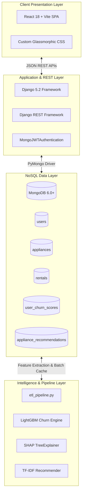

# Project Proposal
## Project Name: RentAI – Smart Appliance Rental Platform
**Project Category**: Full-Stack Intelligent Cloud Application & SDC-II Capstone  
**Document Version**: 1.0.0  

---

## 1. Executive Summary

The rapid urban migration of students and young working professionals has fueled massive demand for flexible, asset-light living solutions. In developing economies and major metropolitan hubs, renting home appliances (refrigerators, washing machines, air conditioners, microwaves) is preferred over outright capital ownership. However, existing appliance rental services suffer from three fundamental inefficiencies:
1. High customer churn rates due to lack of personalized proactive retention.
2. Clunky, static catalogs that fail to recommend relevant complementary items.
3. Rigid relational schemas that struggle with multi-city inventory and flexible tenure pricing.

**RentAI** addresses these challenges by uniting a **high-performance MongoDB NoSQL architecture**, a **Django REST backend**, an ultra-responsive **React SPA**, and a state-of-the-art **Explainable Machine Learning Engine (LightGBM + SHAP)**. RentAI transforms the appliance rental lifecycle into a smart, data-driven, and highly engaging consumer experience.

---

## 2. Problem Statement

### 2.1 Industry Background
Rental service businesses operate on recurring subscription-like models. Acquiring a customer requires significant marketing spend, meaning profitability is only realized after a customer completes 6 to 12 months of rental tenure.

### 2.2 Core Operational Challenges
- **Silent Churn**: Customers cancel subscriptions or initiate early returns without prior feedback, leaving operations teams powerless to intervene.
- **Black-Box Analytics**: Traditional churn scoring models output raw probabilities without explaining the underlying behavioral triggers, preventing actionable human interventions.
- **Cross-Selling Failure**: Platforms display static listings rather than dynamically suggesting items based on user preferences and collaborative catalog associations.
- **Relational Impedance Mismatch**: Traditional SQL databases require complex joins across products, variant tenures (3, 6, 12 months), and city availabilities, introducing latency and schema rigidity.

---

## 3. Project Objectives

### 3.1 Quantitative Objectives
- **Sub-150ms Response Latency**: Deliver catalog searches and recommendations with sub-second responsiveness.
- **Churn Prediction Accuracy**: Achieve $\ge 85\%$ ROC-AUC and $\ge 80\%$ F1-score on customer behavioral churn modeling.
- **Real-Time Recommendation Generation**: Deliver personalized recommendations in $< 50\text{ms}$ using pre-computed vector indexing.
- **Automated Lifecycle Transitions**: 100% automated stock updates upon checkout and contract termination.

### 3.2 Qualitative Objectives
- Provide a clean, glassmorphic UI that simplifies multi-city rental selection and tenure customization.
- Empower operational and customer retention managers with plain-English SHAP reason codes.
- Ensure strict security compliance with tokenized authentication and robust data isolation.

---

## 4. Scope Baseline

### 4.1 In-Scope Features
1. **User Identity & Security**: Registration, JWT login, token refresh, role-based access control (Customer vs. Admin).
2. **Dynamic Inventory Management**: Multi-city catalog filtering, dynamic tenure pricing, live stock decrement and restoration.
3. **Shopping Cart & Contract Engine**: Persistent shopping cart, contract duration configuration, atomic checkout, and active rental history tracking.
4. **Returns Management**: Scheduled return processing with automatic stock replenishment.
5. **Machine Learning Pipeline**:
   - Automated behavioral feature extraction (tenure, spend, late payments, ratings).
   - LightGBM binary churn classification.
   - SHAP value explainability generator.
   - TF-IDF and Cosine Similarity collaborative recommendation engine.
6. **Executive Admin Portal**: Real-time revenue analytics, active rental monitoring, and high-risk churn intervention dashboard.

### 4.2 Out-of-Scope (Future Iterations)
- Direct physical IoT telemetry integration for live appliance condition monitoring.
- Integration with third-party debt collection agencies.
- International multi-currency conversion (INR is the baseline currency).

---

## 5. Architectural Blueprint

---

## 6. Risk Management Matrix

| Risk ID | Description | Severity | Likelihood | Mitigation Strategy |
|---|---|---|---|---|
| **R-01** | Heavy ML training blocking web request threads | High | High | Strict decoupling: ML training runs in dedicated out-of-band scripts (`train_model.py`), caching pre-computed scores in MongoDB. |
| **R-02** | Inventory overselling under race conditions | High | Medium | Atomic MongoDB queries using `$inc` operators and validation guards before booking confirmation. |
| **R-03** | User session hijacking via token interception | High | Low | Short-lived JWT access tokens (15 mins), secure HTTP transmission, and token refresh mechanisms. |
| **R-04** | Imbalanced customer churn training data | Medium | Medium | Utilization of SMOTE and scale-pos-weight parameter tuning within LightGBM classifier. |

---

## 7. Deliverables & Acceptance Criteria

1. **Working Full-Stack Platform**:
   - Backend running on `http://127.0.0.1:8000`.
   - Frontend running on `http://localhost:5173`.
2. **Automated Verification Suite**:
   - Passing test script `test_all_modules_fast.py` validating all 8 functional modules.
3. **Comprehensive Documentation Suite**:
   - Complete set of 13 Software Engineering Documents and 7 Academic/Research Documents.
4. **Machine Learning Artifacts**:
   - Verified LightGBM churn model, SHAP reason codes, and TF-IDF recommender matrix.
