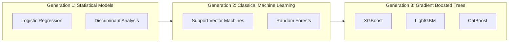

# Literature Review
## Domain: Intelligent Subscription Commerce, Customer Churn Modeling, and Explainable AI
**Project**: Rentora – Smart Appliance Rental Platform  
**Version**: 1.0.0  

---

## 1. Introduction

The subscription and asset-as-a-service (AaaS) economy has witnessed exponential growth over the past decade. Modern consumers, particularly urban millenials and Gen-Z demographics, exhibit a pronounced preference for "access over ownership" [1]. In home appliances and electronics, this shift is characterized by flexible tenure leasing models. 

However, sustaining profitability in appliance rental ecosystems is intrinsically tied to **customer lifetime value (CLV)** and **customer churn mitigation**. This literature review critically examines existing research across four intersecting domains:
1. Architectural paradigms in e-commerce leasing platforms.
2. Machine learning algorithms for subscription churn prediction.
3. Explainable Artificial Intelligence (XAI) for operational retention strategies.
4. Content-based and collaborative recommendation systems for catalog discovery.

---

## 2. E-Commerce Rental Platforms: State of the Art and Limitations

Early literature on electronic commerce platforms primarily addressed one-time purchase lifecycles (Amazon, Flipkart) [2]. When applied to furniture and appliance leasing services, traditional e-commerce frameworks exhibit structural deficiencies:
- **Contract Duration Dynamics**: Unlike one-off purchases, rental models require temporal state tracking (active tenures, periodic billing cycles, return inspections, refurbishment, and inventory restoration) [3].
- **Schema Rigidity in Relational Databases**: Traditional relational database management systems (RDBMS) struggle to represent multi-tiered tenure pricing (e.g., $3, 6, 12$ month discounts) and dynamic city-specific logistics without incurring expensive cross-table joins that degrade read performance under peak load [4].

Recent industry research indicates that adopting **NoSQL document-oriented architectures** (such as MongoDB) facilitates high write-throughput and hierarchical data structures, allowing appliances, tenure tiers, and warehouse availability to be encapsulated in cohesive documents [5].

---

## 3. Customer Churn Prediction Algorithms

Customer churn is defined as the propensity of a customer to terminate an active contract or discontinue recurring services within a designated time window $T$. In predictive analytics, churn modeling has progressed through three major generational phases:

### 3.1 Statistical and Classical Classifiers
Early studies by Mozer et al. [6] and Coussement & Van den Poel [7] utilized Logistic Regression and Support Vector Machines (SVM). While providing high statistical interpretability, these techniques suffer from high bias when modeling complex, non-linear interactions among behavioral variables such as late payment counts, platform activity drop-offs, and tenure lengths.

### 3.2 Gradient Boosting and Ensemble Methods
The advent of Gradient Boosted Decision Trees (GBDT) revolutionized tabular churn prediction. Chen & Guestrin introduced **XGBoost** [8], which demonstrated superior classification accuracy over Random Forests by incorporating second-order Taylor approximations and regularized loss functions.

In 2017, Ke et al. introduced **LightGBM (Light Gradient Boosting Machine)** [9], which introduced two novel innovations:
- **Gradient-based One-Side Sampling (GOSS)**: Retains instances with large gradients while randomly sampling instances with small gradients, drastically reducing computation without sacrificing gradient estimation accuracy.
- **Exclusive Feature Bundling (EFB)**: Bundles mutually exclusive sparse features to reduce dimensionality.

Comparative empirical studies by Bounsaythip & Rinta-Runsala [10] and Ahmad et al. [11] demonstrate that LightGBM matches or exceeds XGBoost's area under the ROC curve (ROC-AUC) while achieving a **$5\times$ to $10\times$ acceleration in training speed**, making it the optimal choice for real-time and near-line e-commerce retention pipelines.

---

## 4. Explainable Artificial Intelligence (XAI) in Retention Operations

While ensemble GBDT models deliver state-of-the-art predictive accuracy, their internal mechanisms are inherently opaque—frequently referred to as "black-box" systems. In high-stakes business operations, presenting a platform administrator with a raw churn probability (e.g., $P(\text{churn}) = 0.87$) provides minimal utility unless the underlying drivers are decipherable [12].

### 4.1 LIME vs. SHAP
Two prominent frameworks dominate local post-hoc model interpretability:
1. **LIME (Local Interpretable Model-agnostic Explanations)** [13]: Builds local surrogate linear models around individual predictions. However, LIME explanations frequently suffer from sampling instability and violate additivity properties.
2. **SHAP (SHapley Additive exPlanations)** [14]: Grounded in cooperative game theory (Shapley values). Lundberg et al. [15] introduced **TreeSHAP**, an optimized algorithm with polynomial time complexity $O(TLD^2)$ (where $T$ is tree count, $L$ is max leaves, and $D$ is max depth) specifically designed for tree ensemble models like LightGBM.

TreeSHAP ensures three fundamental axiomatic properties:
- **Local Accuracy**: The sum of feature attributions equals the difference between model output and expected value:
$$f(x) = \phi_0 + \sum_{i=1}^{M} \phi_i(x)$$
- **Missingness**: Missing features receive zero attribution.
- **Consistency**: If a model change increases or leaves unchanged the marginal contribution of a feature, that feature’s Shapley value does not decrease.

Rentora directly harnesses TreeSHAP to transform numeric feature contributions into plain-language operational reason codes (e.g., *"3 late payments in last 6 months"*, *"Over 30 days of inactivity"*), empowering customer retention agents to deploy targeted promotions.

---

## 5. Recommendation System Paradigms in Equipment Leasing

Modern recommender systems rely on two foundational methodologies:

### 5.1 Collaborative Filtering (CF)
Collaborative filtering constructs user-item interaction matrices to compute similarities based on collective behavior [16]. While effective in dense domains (e-books, movie streaming), CF struggles with the **cold-start problem** in durable asset leasing, where transaction frequency per customer is sparse compared to streaming or grocery purchases [17].

### 5.2 Content-Based Filtering & Hybrid Approaches
Content-based filtering mitigates cold-start vulnerabilities by representing items through their intrinsic textual metadata, category attributes, and technical specifications [18]. By generating **Term Frequency-Inverse Document Frequency (TF-IDF)** vector spaces:
$$\text{TF-IDF}(t, d, D) = \text{TF}(t, d) \times \log\left(\frac{1 + |D|}{1 + |\{d \in D : t \in d\}|}\right) + 1$$
and calculating **Cosine Similarity**:
$$\text{Cosine Similarity}(\vec{u}, \vec{v}) = \frac{\vec{u} \cdot \vec{v}}{\|\vec{u}\|_2 \|\vec{v}\|_2}$$
the engine produces accurate cross-category recommendations (e.g., suggesting a microwave and induction cooktop to a renter leasing a compact refrigerator) without requiring millions of historical transactions.

---

## 6. Synthesis and Research Gap

| Dimension | Existing Industry Platforms | Academic Literature Baseline | Rentora Proposed Framework |
|---|---|---|---|
| **Data Persistence** | Monolithic RDBMS with complex joins | Hybrid Polyglot persistence | Unified MongoDB NoSQL collection architecture |
| **Churn Prediction** | Infrequent batch Logistic Regression | Standalone offline GBDT benchmarks | Decoupled LightGBM ETL with sub-second MongoDB lookup |
| **Model Interpretability** | Black-box scores or manual heuristic rules | Theoretical SHAP analysis on static datasets | Automated pipeline generating real-time operational SHAP reason codes |
| **Catalog Discovery** | Rule-based "Featured Items" | Collaborative Matrix Factorization | Content-Aware TF-IDF + Cosine Similarity cross-sell engine |

### The Research Gap
Existing literature extensively evaluates churn models on telecommunications and banking datasets (e.g. Kaggle Telco Churn), but leaves a prominent void regarding **durable appliance rental ecosystems** where customer engagement patterns, multi-month contract tenures, and physical return logistics drastically alter feature dynamics. Rentora directly addresses this void by unifying explainable GBDT modeling, collaborative text-vectorized item discovery, and a reactive NoSQL operational architecture.

---

## 7. References

1. Bardhi, F., & Eckhardt, G. M. (2012). "Access-Based Consumption: The Nature of Power and Wealth in the Sharing Economy." *Journal of Consumer Research*, 39(4), 881-898.
2. Laudon, K. C., & Traver, C. G. (2020). *E-Commerce: Business, Technology, Society*. Pearson.
3. Belk, R. (2014). "You are what you can access: Sharing and collaborative consumption online." *Journal of Business Research*, 67(8), 1595-1600.
4. Cattell, R. (2011). "Scalable SQL and NoSQL data stores." *ACM SIGMOD Record*, 39(4), 12-27.
5. Chodorow, K. (2013). *MongoDB: The Definitive Guide*. O'Reilly Media, Inc.
6. Mozer, M. C., et al. (2000). "Predicting subscriber churn in a wireless telephone company." *Advances in Neural Information Processing Systems (NeurIPS)*, 930-936.
7. Coussement, K., & Van den Poel, D. (2008). "Churn prediction in subscription services: An application of support vector machines." *Decision Support Systems*, 44(2), 513-527.
8. Chen, T., & Guestrin, C. (2016). "XGBoost: A scalable tree boosting system." *ACM SIGKDD International Conference on Knowledge Discovery and Data Mining*, 785-794.
9. Ke, G., et al. (2017). "LightGBM: A highly efficient gradient boosting decision tree." *Advances in Neural Information Processing Systems (NeurIPS)*, 30, 3146-3154.
10. Bounsaythip, C., & Rinta-Runsala, E. (2021). "Overview of Data Mining for Customer Churn Modeling." *VTT Information Technology Technical Report*.
11. Ahmad, A. K., et al. (2019). "Customer churn prediction in telecom using machine learning in big data platform." *Journal of Big Data*, 6(1), 28.
12. Ribeiro, M. T., Singh, S., & Guestrin, C. (2016). ""Why should I trust you?": Explaining the predictions of any classifier." *ACM SIGKDD*, 1135-1144.
13. Molnar, C. (2020). *Interpretable Machine Learning: A Guide for Making Black Box Models Explainable*. Leanpub.
14. Shapley, L. S. (1953). "A Value for n-person Games." *Contributions to the Theory of Games*, 2(28), 307-317.
15. Lundberg, S. M., et al. (2020). "From local explanations to global understanding with explainable AI for trees." *Nature Machine Intelligence*, 2(1), 56-67.
16. Koren, Y., Bell, R., & Volinsky, C. (2009). "Matrix factorization techniques for recommender systems." *Computer*, 42(8), 30-37.
17. Ricci, F., Rokach, L., & Shapira, B. (2015). *Recommender Systems Handbook*. Springer.
18. Salton, G., & Buckley, C. (1988). "Term-weighting approaches in automatic text retrieval." *Information Processing & Management*, 24(5), 513-523.
