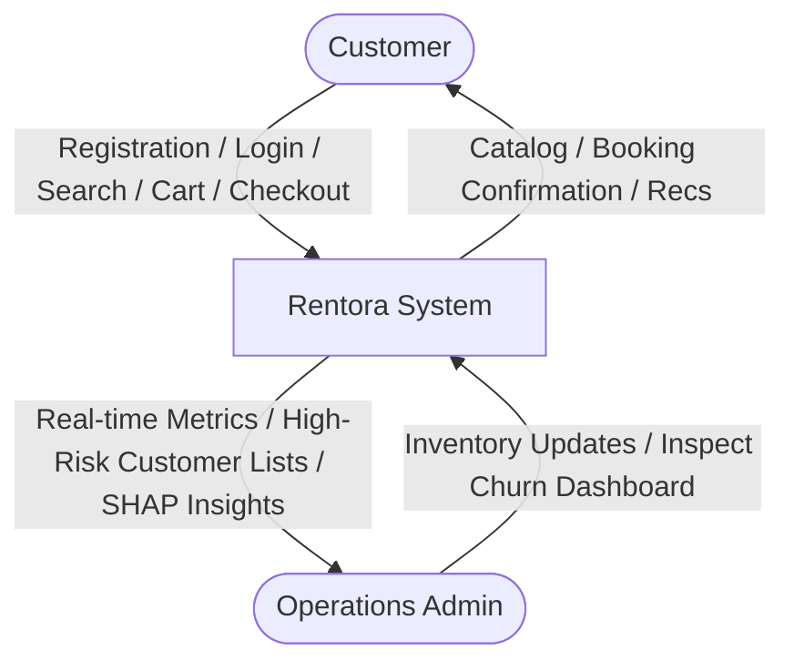
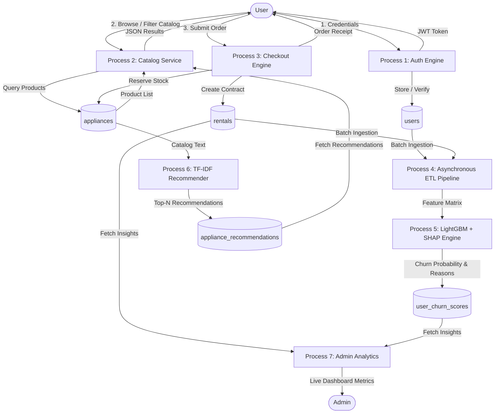

# System Design Document (SDD – High Level)
## Project: Rentora – Smart Appliance Rental Platform
**Document Version**: 1.0.0  
**Status**: Baselined Architecture  

---

## 1. System Overview and Architectural Style

Rentora is engineered as a **distributed, decoupled three-tier web architecture** combined with an **out-of-band asynchronous Machine Learning pipeline**. 

```mermaid
graph TB
    subgraph PresentationTier [Presentation Tier (Client SPA)]
        UI[React 18 Single Page App]
        Vite[Vite Bundler & Dev Engine]
        Axios[Axios HTTP Client with Interceptors]
    end

    subgraph ApplicationTier [Application Tier (Django REST Framework)]
        Gateway[Django WSGI / ASGI Gateway]
        AuthMiddleware[MongoJWTAuthentication Middleware]
        Router[Django URL Dispatcher]
        
        subgraph ViewControllers [View Controllers]
            V_Auth[Register / Login / Refresh]
            V_App[Appliance Catalog]
            V_Cart[Cart & Checkout]
            V_Rent[Rentals & Returns]
            V_Admin[Admin Analytics]
            V_Rec[Recommendations]
        end
    end

    subgraph DataTier [Data & Persistence Tier (MongoDB 6.0+)]
        MongoClient[PyMongo Connection Pool]
        
        subgraph Collections [MongoDB Collections]
            C_Users[(users)]
            C_Apps[(appliances)]
            C_Rents[(rentals)]
            C_Carts[(carts)]
            C_Churn[(user_churn_scores)]
            C_Recs[(appliance_recommendations)]
        end
    end

    subgraph IntelligenceTier [Intelligence & Asynchronous ML Tier]
        ETL[etl_pipeline.py - Behavioral Aggregator]
        Trainer[train_model.py - Model Pipeline]
        LGBM[LightGBM Churn Classifier]
        SHAP[SHAP TreeExplainer]
        TFIDF[TF-IDF Vector Space Matrix]
    end

    %% Connections
    PresentationTier <==>|HTTPS / JSON REST / Bearer JWT| ApplicationTier
    ApplicationTier <==>|PyMongo Native Connection / localhost:27017| DataTier
    
    IntelligenceTier -.->|Extract Aggregates| DataTier
    IntelligenceTier -.->|Batch Write Scores & Recommendations| DataTier
```

---

## 2. Subsystem Decomposition

The Rentora ecosystem is decomposed into 8 highly cohesive, loosely coupled functional modules:

### 2.1 Module 1: User Authentication & Profile Management
- **Role**: Manages user registration, login authentication, token renewal, and profile identity records.
- **Security**: Cryptographically hashes passwords using PBKDF2 SHA-256 (`django.contrib.auth.hashers.make_password`). Generates and verifies custom JWTs (`api/mongo_auth.py`) containing the user's UUID, email, and role.
- **Data Collections**: Interacts directly with the `users` collection in MongoDB.

### 2.2 Module 2: Appliance Inventory Management
- **Role**: Provides a dynamic catalog of appliances across multi-city distribution hubs (e.g. Bangalore, Mumbai, Delhi, Hyderabad).
- **Features**: Supports multi-tenure pricing tiers (`3m`, `6m`, `12m`), refundable security deposits, rich image arrays, and granular stock inventory levels.
- **Data Collections**: Operates on the `appliances` collection.

### 2.3 Module 3: Rental & Booking Engine
- **Role**: Governs the end-to-end lease acquisition workflow.
- **Workflow**: Manages persistent carts, validates inventory availability, executes checkout transactions, decrements stock quantities atomically, and generates active `Rental` records.
- **Data Collections**: Reads/writes to `carts` and `rentals` collections.

### 2.4 Module 4: Payment & Asset Return Processing
- **Role**: Records lease payments and tracks physical appliance asset returns.
- **Workflow**: Allows customers or administrators to mark rentals as `RETURNED`, logs termination timestamps, and automatically increments the appliance `stock_quantity` back into circulation.
- **Data Collections**: Updates `rentals` and `appliances` collections.

### 2.5 Module 5: Machine Learning Data Pipeline (ETL)
- **Role**: Decouples analytical computing from transactional operations.
- **Workflow**: Script `etl_pipeline.py` extracts raw transaction events across `users`, `rentals`, and `carts`, transforms them into standardized behavioral vectors (tenure, late payments, spend, early returns), and loads them into analytical training sets.

### 2.6 Module 6: Churn Prediction Engine (AI Model 1)
- **Role**: Predicts customer attrition likelihood before it occurs.
- **Technology**: Utilizes a trained **LightGBM** classifier.
- **Interpretability**: Generates individual **SHAP** attribution values for each prediction, generating human-readable reason codes (e.g. *"High frequency of late payments"*, *"Prolonged inactivity"*).
- **Data Collections**: Writes predictions to the `user_churn_scores` collection.

### 2.7 Module 7: Collaborative Recommendation Engine (AI Model 2)
- **Role**: Cross-sells complementary appliances to enhance customer satisfaction and revenue.
- **Technology**: Constructs a **TF-IDF Vector Space** across appliance names, categories, and technical specifications, computing pairwise **Cosine Similarities**.
- **Data Collections**: Writes top recommendations to `appliance_recommendations`.

### 2.8 Module 8: Admin Analytics Dashboard
- **Role**: Provides business stakeholders with real-time operational insights.
- **Features**: Visualizes gross rental revenue, active lease counts, platform churn distribution, and high-risk customer tables with corresponding SHAP reason codes for targeted retention campaigns.

---

## 3. Data Flow Diagrams (DFD)

### 3.1 DFD Level 0 (Context Diagram)



### 3.2 DFD Level 1 (System Process Flow)



---

## 4. Scalability, High Availability, and Fault Tolerance

### 4.1 Horizontal Scaling
- **Stateless Web Tier**: Django processes maintain no in-memory user session state; user identity is decoded on-the-fly from signed JWT tokens. Multiple Gunicorn worker processes can be scaled horizontally behind an Nginx load balancer without sticky sessions.
- **NoSQL Sharding**: MongoDB natively supports horizontal sharding across distributed replica sets using hashed shard keys (`user_id` or `city`).

### 4.2 Decoupled Analytical Computation
The operational database is shielded from compute-intensive machine learning workloads. Heavy GBDT training and SHAP tree traversals occur out-of-band during off-peak windows or on dedicated compute nodes, persisting results to pre-indexed cache collections.

### 4.3 Fault Tolerance & Circuit Breaking
- If the machine learning pipeline is temporarily unavailable, the REST API degrades gracefully: the recommendation endpoint serves top-rated popular appliances, and the admin dashboard marks churn scores as `Pending Refresh`, ensuring core rental transactions remain $100\%$ operational.
