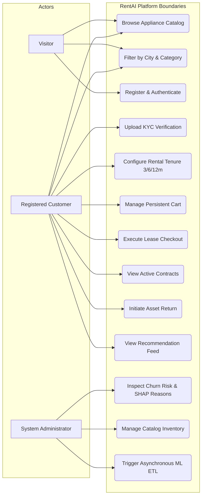
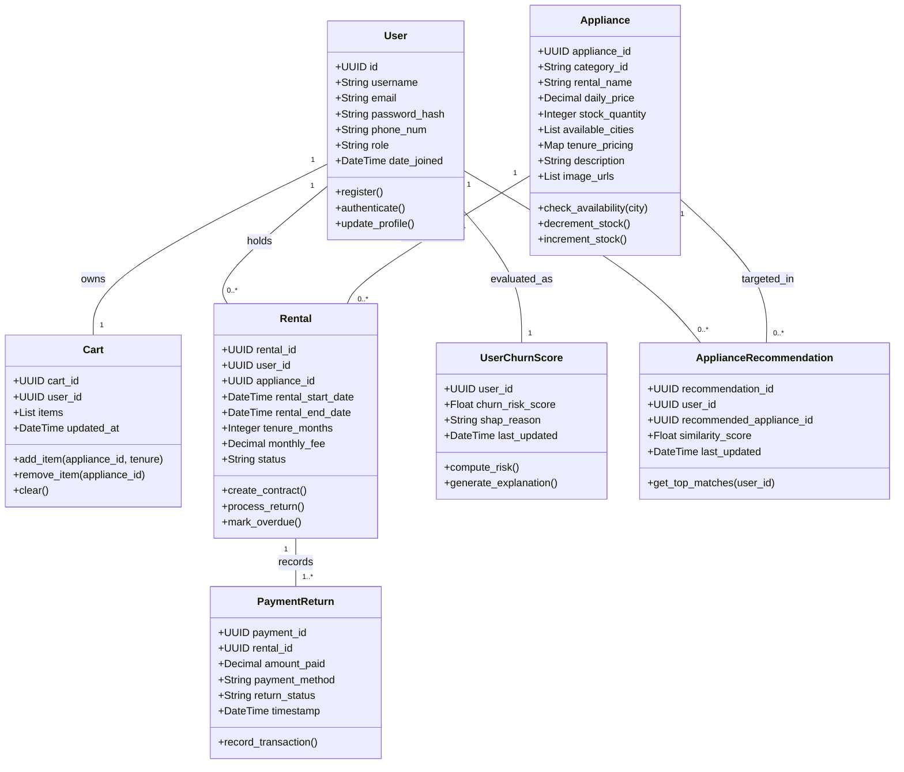
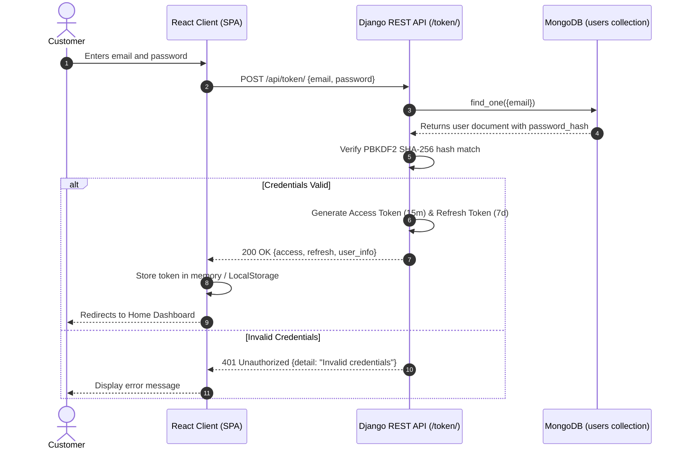
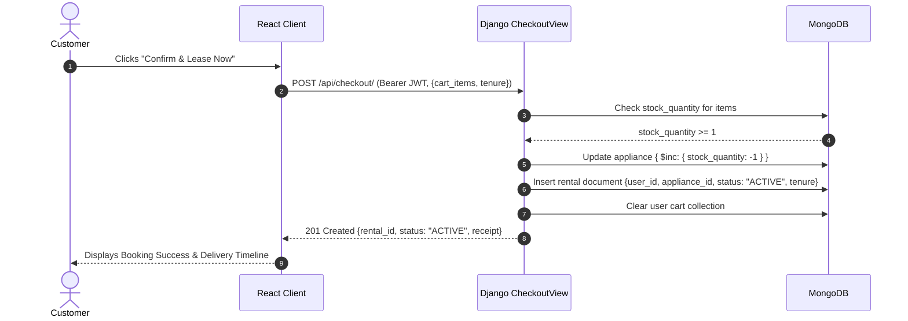
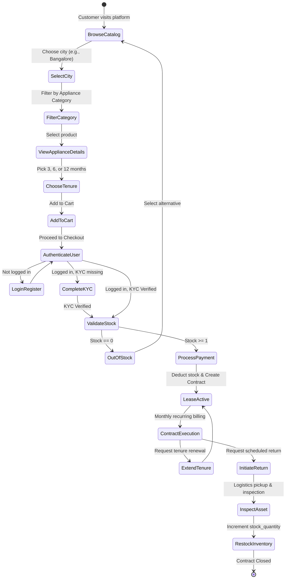
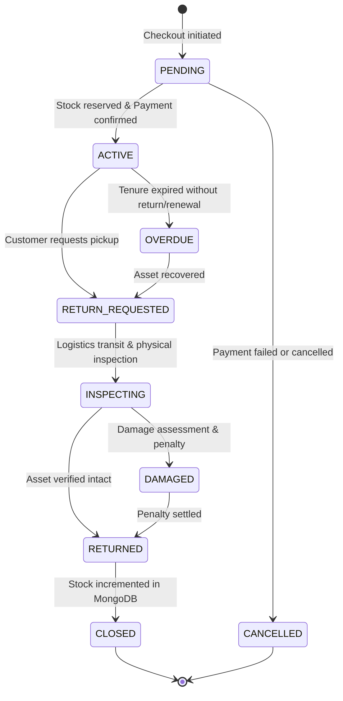
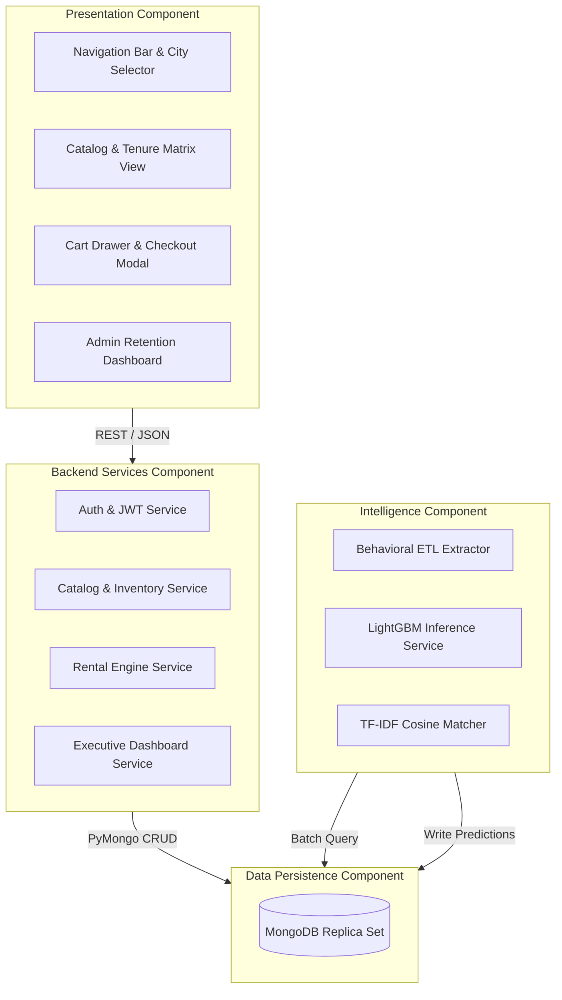

# UML Documentation
## Project: RentAI – Smart Appliance Rental Platform
**Standard**: Unified Modeling Language (UML 2.5)  
**Version**: 1.0.0  

---

## 1. Introduction

This document formalizes the object-oriented and structural models of the **RentAI** system using standard UML 2.5 notation rendered via interactive Mermaid diagrams. The models encompass functional behavioral views (Use Case, Sequence, Activity, State) and structural engineering views (Class, Component).

---

## 2. Use Case Diagram

The Use Case model defines the functional interactions between system actors (Unregistered Visitor, Registered Customer, System Administrator) and the platform boundaries.

---

## 3. Class Diagram

The Class Diagram illustrates the structural entities, attributes, methods, and relational multiplicities within the system.

---

## 4. Sequence Diagrams

### 4.1 Sequence Diagram 1: User Authentication & JWT Acquisition

### 4.2 Sequence Diagram 2: Cart Checkout & Contract Generation

---

## 5. Activity Diagram: Customer Rental Lifecycle

---

## 6. State Machine Diagram: Rental Contract States

---

## 7. Component Diagram

