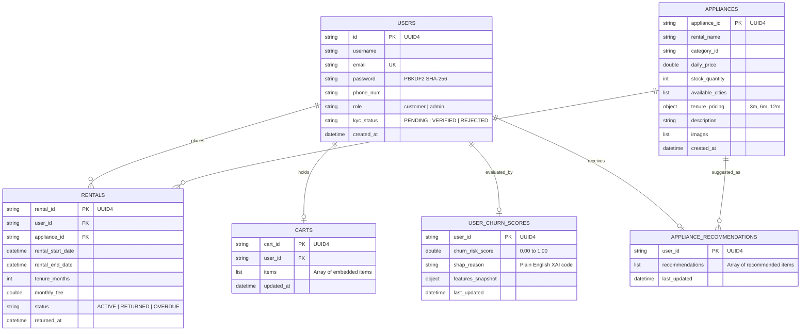

# Database Design Document (DDD)
## Project: Rentora – Smart Appliance Rental Platform
**Database Engine**: MongoDB 6.0+ (NoSQL Document Store)  
**ORM / Driver**: PyMongo 4.6+ & Django ORM Adapter  
**Version**: 1.0.0  

---

## 1. Database Architectural Rationale

Traditional relational database management systems (RDBMS) impose strict tabular normalization. In durable goods rental platforms, this introduces operational bottlenecks:
1. **Dynamic Catalog Polymorphism**: Electronic appliances possess heterogeneous specifications (e.g. refrigerators require *capacity in liters*, *energy star rating*, *defrost type*; whereas air conditioners require *tonnage*, *inverter technology*, *ISEER rating*). Storing these in SQL requires either dozens of nullable columns or expensive Entity-Attribute-Value (EAV) joins.
2. **Multi-Tenure Pricing Matrices**: Rental durations ($3, 6, 12$ months) with localized city availability arrays map naturally to nested BSON documents.
3. **High Read Throughput for Recommendations**: Persisting pre-computed machine learning inferences directly into document stores provides $O(1)$ key lookup latency without relational joins.

---

## 2. Entity-Relationship & Collection Mapping



---

## 3. Detailed Collection Specifications

### 3.1 Collection: `users`
Stores customer credentials, access roles, and identity verification statuses.

```json
{
  "_id": "ObjectId('65fa1a2b8e3d4c1a2b3c4d5e')",
  "id": "e4b105a2-9f17-48f8-821b-cfc1901a1c92",
  "username": "sarah_tech",
  "email": "sarah.tech@example.com",
  "password": "pbkdf2_sha256$600000$p9Z...$d8F2...",
  "phone_num": "+919876543210",
  "role": "customer",
  "kyc_status": "VERIFIED",
  "kyc_documents": [
    {
      "doc_type": "AADHAAR",
      "doc_url": "https://secure-storage.rentora.com/kyc/e4b105a2_aadhaar.pdf",
      "uploaded_at": "2026-03-12T10:15:30Z"
    }
  ],
  "created_at": "2026-01-10T08:00:00Z"
}
```

### 3.2 Collection: `appliances`
The primary master inventory catalog supporting multi-city stock and dynamic tenure leasing.

```json
{
  "_id": "ObjectId('65fa1a2b8e3d4c1a2b3c4d5f')",
  "appliance_id": "b304e287-21a1-4322-901d-5b3ea7129598",
  "rental_name": "Samsung 253L Double Door Inverter Refrigerator",
  "category_id": "refrigerators",
  "daily_price": 28.50,
  "stock_quantity": 8,
  "available_cities": ["Bangalore", "Mumbai", "Hyderabad", "Delhi"],
  "tenure_pricing": {
    "3": { "monthly_price": 855.00, "deposit": 1500.00 },
    "6": { "monthly_price": 750.00, "deposit": 1200.00 },
    "12": { "monthly_price": 620.00, "deposit": 1000.00 }
  },
  "specifications": {
    "capacity": "253 Liters",
    "energy_rating": "3 Star",
    "defrosting_type": "Frost Free"
  },
  "images": [
    "https://images.rentora.com/products/ref_samsung_253l_1.webp",
    "https://images.rentora.com/products/ref_samsung_253l_2.webp"
  ],
  "description": "Energy-efficient double door refrigerator ideal for families of 3-4.",
  "created_at": "2026-01-15T09:30:00Z"
}
```

### 3.3 Collection: `rentals`
Captures operational lease contracts, billing terms, and physical return timestamps.

```json
{
  "_id": "ObjectId('65fa1a2b8e3d4c1a2b3c4d60')",
  "rental_id": "7a3019cf-b7c1-419b-a359-5431cb30129a",
  "user_id": "e4b105a2-9f17-48f8-821b-cfc1901a1c92",
  "appliance_id": "b304e287-21a1-4322-901d-5b3ea7129598",
  "rental_start_date": "2026-02-01T00:00:00Z",
  "rental_end_date": "2026-08-01T00:00:00Z",
  "tenure_months": 6,
  "monthly_fee": 750.00,
  "deposit_held": 1200.00,
  "status": "ACTIVE",
  "returned_at": null,
  "delivery_address": {
    "city": "Bangalore",
    "postal_code": "560102",
    "street": "14th Main, HSR Layout Sector 4"
  }
}
```

### 3.4 Collection: `user_churn_scores`
Stores pre-computed behavioral predictions and SHAP explainability reason codes.

```json
{
  "_id": "ObjectId('65fa1a2b8e3d4c1a2b3c4d61')",
  "user_id": "e4b105a2-9f17-48f8-821b-cfc1901a1c92",
  "churn_risk_score": 0.7420,
  "risk_category": "HIGH",
  "shap_reason": "3 late payments in last 6 months; 24 days without app activity",
  "features_snapshot": {
    "tenure_months": 4,
    "monthly_spend": 750.0,
    "late_payments": 3,
    "early_returns": 0,
    "cart_abandonment": 2,
    "days_inactive": 24,
    "avg_rating": 2.5
  },
  "last_updated": "2026-03-22T04:00:00Z"
}
```

### 3.5 Collection: `appliance_recommendations`
Stores top similarity scores for sub-50ms query response on customer portals.

```json
{
  "_id": "ObjectId('65fa1a2b8e3d4c1a2b3c4d62')",
  "user_id": "e4b105a2-9f17-48f8-821b-cfc1901a1c92",
  "recommendations": [
    {
      "appliance_id": "90d19ca2-4322-411a-8291-a128e4019283",
      "rental_name": "LG 28L Convection Microwave Oven",
      "similarity_score": 0.884,
      "category_id": "microwaves"
    },
    {
      "appliance_id": "55b39ca1-1122-488b-9912-b349f5012934",
      "rental_name": "Philips Digital Air Fryer 4.1L",
      "similarity_score": 0.812,
      "category_id": "kitchen_appliances"
    }
  ],
  "last_updated": "2026-03-22T04:05:00Z"
}
```

---

## 4. Indexing & Optimization Strategy

To satisfy sub-150ms latency guarantees, custom indexes are established across primary access paths:

| Collection | Indexed Fields | Index Type | Purpose |
|---|---|---|---|
| `users` | `email` | Unique Ascending | Fast login authentication & duplicate prevention |
| `users` | `id` | Unique Ascending | Foreign key lookup from rentals |
| `appliances` | `available_cities`, `category_id` | Compound Multikey | Multi-attribute catalog filtering |
| `appliances` | `rental_name` | Text Index | Free-text keyword search |
| `rentals` | `user_id`, `status` | Compound Ascending | Filtering user active contracts |
| `user_churn_scores` | `user_id` | Unique Ascending | Instant user churn retrieval |
| `user_churn_scores` | `churn_risk_score` | Descending | Rapid admin sorting of highest-risk customers |

---

## 5. Concurrency Control and Data Integrity

To prevent race conditions during high-volume checkout (e.g. two users checking out the final available unit simultaneously), Rentora executes **Atomic Conditional Updates**:

```python
# Atomic stock reservation in MongoDB
result = db.appliances.update_one(
    {
        "appliance_id": appliance_id,
        "stock_quantity": {"$gte": 1}
    },
    {
        "$inc": {"stock_quantity": -1}
    }
)

if result.modified_count == 0:
    raise InsufficientStockException("Appliance stock unavailable")
```
This guarantees strict linearizability without requiring heavy distributed locks or relational table locks.
