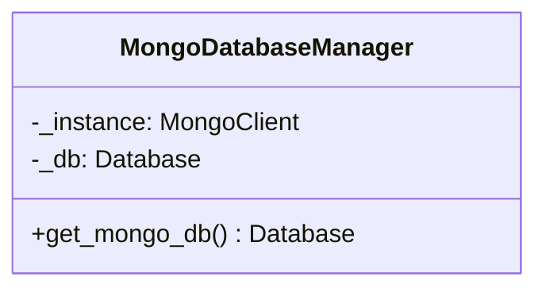
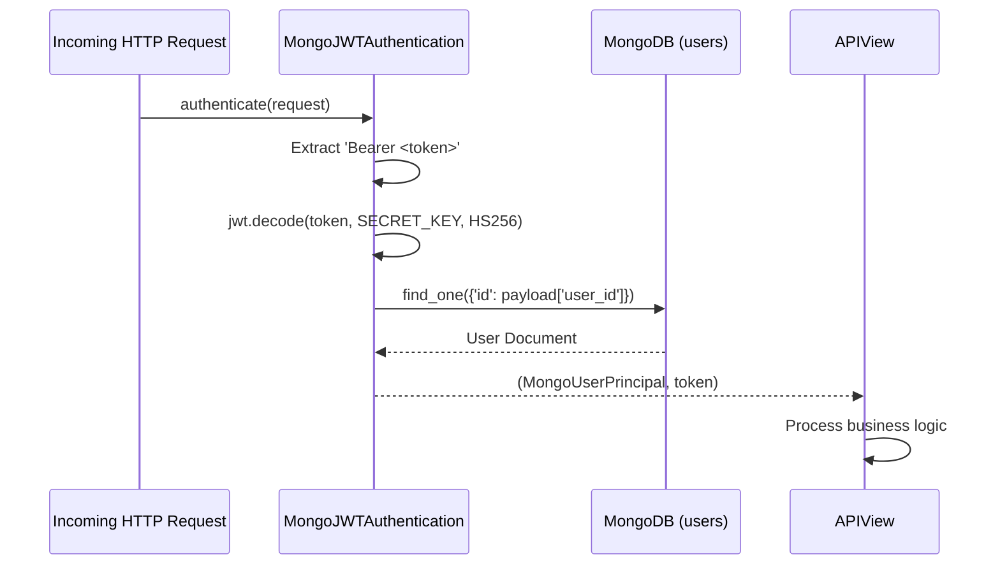
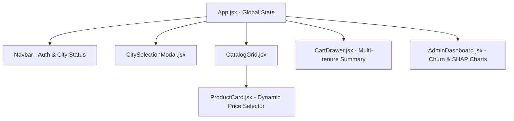

# Software Design Document (SDD – Low Level)
## Project: Rentora – Smart Appliance Rental Platform
**Standard**: IEEE Std 1016-2009 (Software Design Descriptions)  
**Version**: 1.0.0  

---

## 1. Introduction and Module Topology

This Low-Level Software Design Document outlines the detailed class hierarchies, algorithmic workflows, interface contracts, and design patterns utilized in the **Rentora** backend and frontend codebases.

### 1.1 Directory Organization

```
Rentora/
├── api/                           # Backend Django REST Application
│   ├── mongo_client.py            # Singleton MongoDB Connection Pool
│   ├── mongo_auth.py              # Custom JWT Authentication Handler
│   ├── views.py                   # API View Controllers & Business Logic
│   ├── models.py                  # Declarative ORM Stubs for Django Admin
│   └── urls.py                    # RESTful URL Route Definitions
├── ml_pipeline/                   # Data Science & Inference Pipeline
│   ├── etl_pipeline.py            # Behavioral Data Extraction & Vectorization
│   ├── train_model.py             # LightGBM & TF-IDF Training Harness
│   └── evaluate_models.py         # Synthetic Benchmark & Validation Suite
└── frontend/                      # Client Presentation Tier
    ├── src/
    │   ├── CitySelectionModal.jsx # Location-aware City Filtering
    │   ├── App.jsx                # SPA Root & State Management
    │   └── ...                    # Components & Modular Views
```

---

## 2. Design Patterns Implemented

### 2.1 Singleton Pattern: MongoDB Connection Manager
To prevent connection exhaustion and reduce socket initialization overhead, MongoDB connection handles are encapsulated via a thread-safe Singleton pattern in `api/mongo_client.py`:



```python
# Low-level Singleton Implementation (api/mongo_client.py)
from pymongo import MongoClient
from django.conf import settings

_client = None
_db = None

def get_mongo_db():
    global _client, _db
    if _db is None:
        _client = MongoClient(settings.MONGO_URI, maxPoolSize=50, waitQueueTimeoutMS=2500)
        _db = _client[settings.MONGO_DB_NAME]
    return _db
```

### 2.2 Strategy Pattern: Custom JWT Authentication
Rentora avoids tight coupling to Django's default SQL authentication middleware by implementing a custom Strategy (`MongoJWTAuthentication` in `api/mongo_auth.py`) conforming to DRF's `BaseAuthentication`:



### 2.3 State Pattern: Contract Lifecycle State Machine
Rental contracts evolve through distinct state transitions governed by deterministic transition rules:

| Current State | Permissible Event | Target State | Side Effect |
|---|---|---|---|
| `NONE` | `CHECKOUT_CONFIRMED` | `ACTIVE` | Decrement appliance stock |
| `ACTIVE` | `INITIATE_RETURN` | `RETURNED` | Increment appliance stock; record return date |
| `ACTIVE` | `CONTRACT_EXPIRED` | `OVERDUE` | Alert retention & operations teams |
| `OVERDUE` | `RECOVER_ASSET` | `RETURNED` | Calculate late penalties; replenish stock |

---

## 3. Low-Level Component Specifications

### 3.1 `api/views.py` Controller Implementations

#### `RegisterView` & `LoginView`
- **Responsibilities**: Enforces email uniqueness, hashes passwords with salt, encodes JWT claims (`user_id`, `email`, `role`, `exp`), and sets secure headers.
- **Complexity**: $O(1)$ lookup via unique index on `email`.

#### `ApplianceView`
- **Responsibilities**: Builds dynamic MongoDB aggregation filters (`$and` queries combining `available_cities`, `category_id`, and regex search). Formats tenure price matrices for client rendering.
- **Latency Target**: $\le 100\text{ ms}$.

#### `CheckoutView`
- **Responsibilities**: Validates cart contents against live inventory, executes atomic `$inc` updates on MongoDB stock, calculates total fees and deposits, and commits documents to the `rentals` collection.
- **Transaction Safety**: Guaranteed linearizability using atomic document updates.

#### `AdminDashboardView`
- **Responsibilities**: Fetches high-level KPIs (`users.count_documents()`, `rentals.count_documents({'status': 'ACTIVE'})`), calculates gross recurring revenue, and returns the top customer records sorted by `churn_risk_score` descending.

---

## 4. Frontend Component Hierarchy & State Flow



### 4.1 State Management Mechanics
- **Location State**: Persists chosen operational city (e.g. Bangalore) in LocalStorage and Axios default request headers.
- **Authentication State**: Stores the JWT access token in client memory and session storage, with Axios response interceptors triggering silent token renewal via `/api/token/refresh/` upon receiving a `401 Unauthorized`.

---

## 5. Error Handling & Concurrency Model

1. **Database Connection Failures**: Wrapped with standard retry logic and exponential backoff ($250\text{ms} \to 500\text{ms} \to 1000\text{ms}$).
2. **Stock Exhaustion**: Handled with explicit HTTP `409 Conflict` containing human-readable error messages: `"Requested item has been leased by another user. Stock depleted."`
3. **Invalid Tokens**: Returns standardized HTTP `401 Unauthorized` with `TokenExpiredError` claim.
