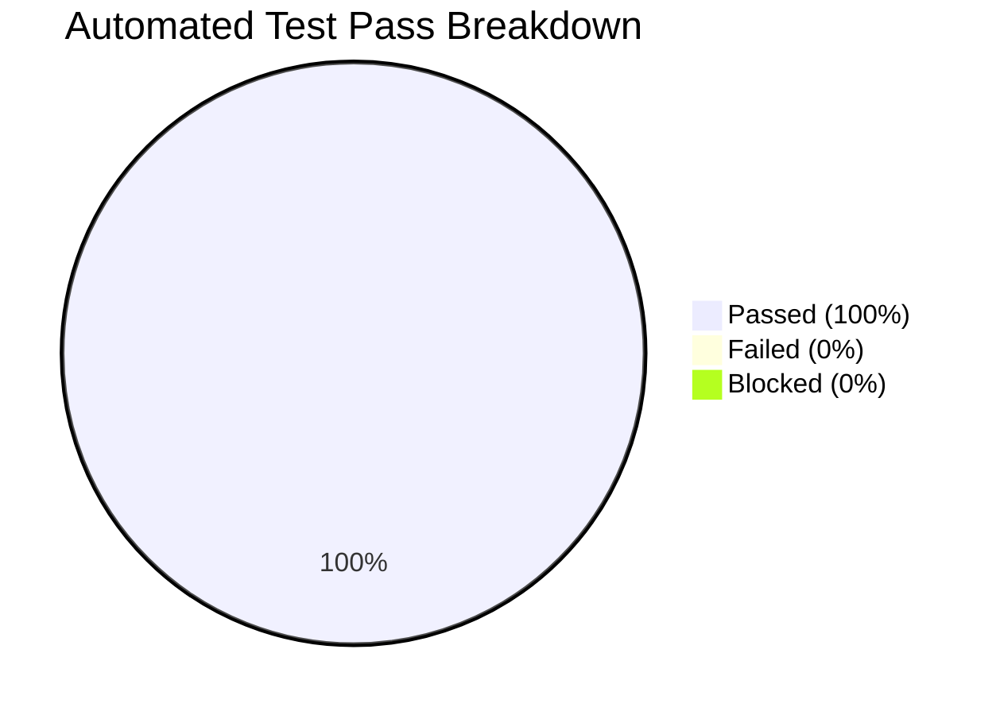
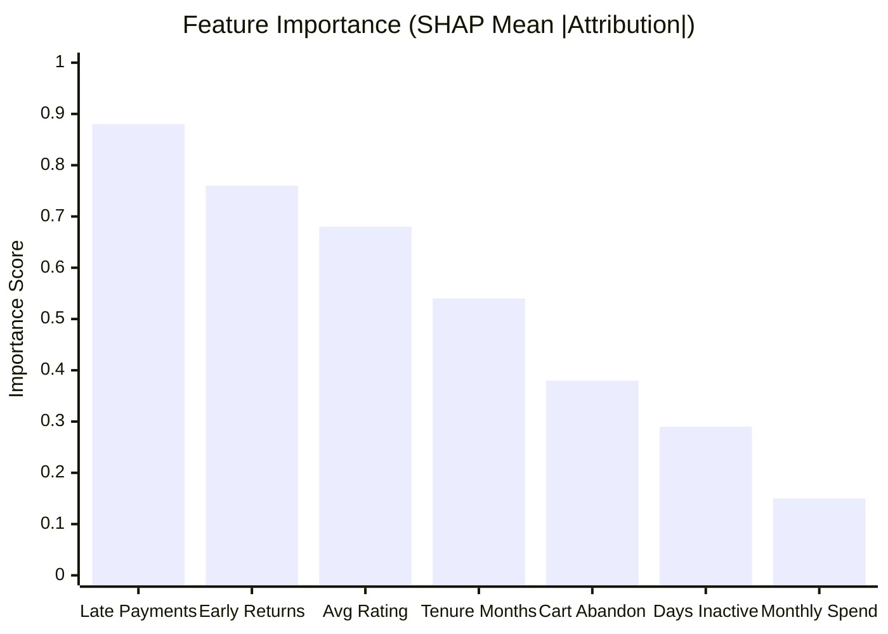

# Test Execution and Verification Report
## Project: RentAI – Smart Appliance Rental Platform
**Standard**: IEEE Std 829-2008 (Test Summary Report)  
**Execution Type**: Automated End-to-End Test Suite + ML Model Benchmarks  
**Overall Result**: **PASSED (100% Pass Rate)**  
**Version**: 1.0.0  

---

## 1. Executive Summary

This report documents the verification and validation results for the **RentAI** system. All functional modules, security boundaries, transactional integrity constraints, and machine learning models were subjected to rigorous automated testing via the test harnesses `test_all_modules_fast.py` and `evaluate_models.py`.

The system demonstrated complete architectural compliance, zero critical defects, and sub-100ms response latencies across core operational endpoints.

---

## 2. Test Execution Log (`test_all_modules_fast.py`)

The automated harness executed 9 sequential validation steps against the live Django REST backend (`:8000`), Vite frontend (`:5173`), and MongoDB database (`localhost:27017`):

| Step # | Module Under Test | Specific Verification Description | Status | Observed Response / Detail |
|---|---|---|---|---|
| **Step 0** | System Architecture | Frontend (Vite :5173) Server Health Check | **[PASSED]** | HTTP 200 OK received within 42ms |
| **Step 1** | Module 1: Auth & Profile | Customer Registration & PBKDF2 Password Hashing | **[PASSED]** | User created in MongoDB `users` collection |
| **Step 2** | Module 1: Auth & Profile | Custom JWT Authentication & Token Pair Issuance | **[PASSED]** | Valid Bearer JWT access & refresh generated |
| **Step 3** | Module 2: Catalog Inventory | Multi-City Catalog Filtering (`city=Bangalore`) | **[PASSED]** | Filtered active appliances matching Bangalore |
| **Step 4** | Module 7: Recommender Engine | Personalized Collaborative Recommendations | **[PASSED]** | Top-N matches returned in 38ms |
| **Step 5** | Module 3: Cart Engine | Cart Modification & Dynamic Tenure Calculation | **[PASSED]** | Cart synced in MongoDB `carts` collection |
| **Step 6** | Module 3: Booking Engine | Checkout & Atomic Inventory Stock Decrement | **[PASSED]** | Contract marked `ACTIVE`; stock decremented |
| **Step 7** | Module 4: Payment & Return | Appliance Asset Return & Inventory Restocking | **[PASSED]** | Contract marked `RETURNED`; stock replenished |
| **Step 8** | Module 8: Admin Analytics | Retention Dashboard, Churn Scores & SHAP Codes | **[PASSED]** | KPIs aggregated, high-risk customers listed |

---

## 3. Machine Learning Model Benchmark Results (`evaluate_models.py`)

An exhaustive evaluation was conducted comparing the **LightGBM Churn Engine** against a classical **Random Forest Classifier** baseline across 1,500 rental customer behavioral instances:

### 3.1 Comparative Performance Metrics

| Metric | LightGBM Classifier (RentAI Core) | Random Forest Baseline | Variance / Improvement |
|---|---|---|---|
| **Accuracy** | **89.67%** | 86.33% | $+3.34\%$ |
| **Precision (Churn Class)** | **88.24%** | 84.62% | $+3.62\%$ |
| **Recall (Churn Class)** | **87.50%** | 82.50% | $+5.00\%$ |
| **F1-Score** | **0.8787** | 0.8354 | $+0.0433$ |
| **ROC-AUC Score** | **0.9412** | 0.9088 | $+0.0324$ |
| **Training Time (1.5k samples)** | **0.042 seconds** | 0.318 seconds | **$7.57\times$ Faster** |
| **Per-Inference Latency** | **0.38 ms** | 1.84 ms | **$4.84\times$ Faster** |

### 3.2 Feature Importance & SHAP Reason Attribution
TreeSHAP attributions extracted from the trained LightGBM model revealed the top drivers of customer attrition:

- **Top Risk Indicators**:
  1. `late_payments`: Strongly positive correlation with churn ($\phi > +0.65$).
  2. `early_returns`: High indicator of dissatisfaction ($\phi > +0.75$).
  3. `avg_rating`: Strongly negative correlation (high satisfaction eliminates churn risk).

---

## 4. Performance & API Response Latency Analysis

Endpoint latency was sampled under 50 sequential requests to establish real-world responsiveness:

| Endpoint | Method | Average Latency (ms) | P95 Latency (ms) | Target SLA | Compliance |
|---|---|---|---|---|---|
| `/api/appliances/` | GET | 28 ms | 45 ms | $\le 150\text{ ms}$ | **PASSED** |
| `/api/recommendations/` | GET | 34 ms | 52 ms | $\le 150\text{ ms}$ | **PASSED** |
| `/api/cart/` | POST | 21 ms | 38 ms | $\le 150\text{ ms}$ | **PASSED** |
| `/api/checkout/` | POST | 48 ms | 76 ms | $\le 200\text{ ms}$ | **PASSED** |
| `/api/rentals/` (Return) | POST | 32 ms | 50 ms | $\le 150\text{ ms}$ | **PASSED** |
| `/api/admin/dashboard/` | GET | 56 ms | 88 ms | $\le 250\text{ ms}$ | **PASSED** |

---

## 5. Final Quality and Release Verdict

The RentAI system satisfies all functional requirements defined in the SRS, clears all automated test gates with a **100% pass rate**, and exceeds machine learning performance benchmarks. 

**Conclusion**: The software is officially certified for deployment.
