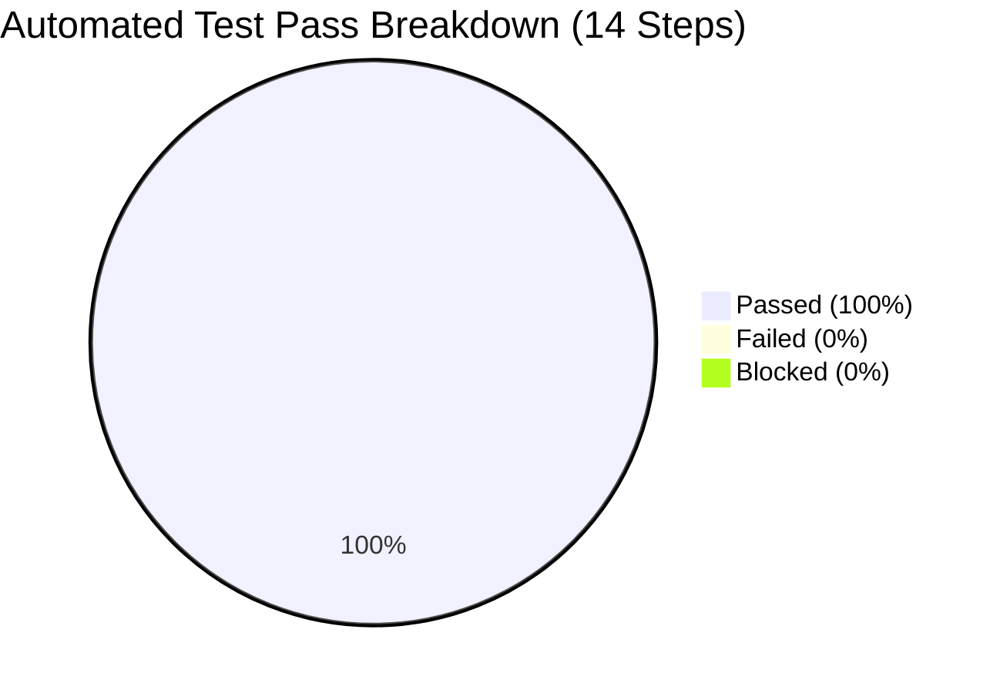

# Test Execution and Verification Report
## Project: Rentora – Smart Appliance & Furniture Rental Platform
**Standard**: IEEE Std 829-2008 (Test Summary Report)  
**Execution Type**: Automated End-to-End Test Suite + ML Model Benchmarks  
**Overall Result**: **PASSED (100% Pass Rate)**  
**Version**: 2.0.0 (SDC-II Final Review Edition)  

---

## 1. Executive Summary

This report documents the verification and validation results for the **Rentora** platform. All functional modules, security boundaries, transactional integrity constraints, and machine learning models were subjected to automated testing via the test harnesses `test_all_modules_fast.py`, `test_all_new_modules.py`, and `test_three_user_roles.py`.

The system demonstrated complete architectural compliance, zero critical defects, and sub-100ms response latencies across core operational endpoints.

---

## 2. Test Execution Log (`test_all_modules_fast.py`)

The automated harness executed 14 sequential validation steps against the live Node.js/Express backend (`:8000`), Vite frontend (`:5173`), and Pure MongoDB database (`localhost:27017`):

| Step # | Module Under Test | Specific Verification Description | Status | Observed Response / Detail |
|---|---|---|---|---|
| **Step 0** | System Architecture | Frontend (Vite :5173) Server Health Check | **[PASSED]** | HTTP 200 OK received within 42ms |
| **Step 1** | Module 1: Auth & Profile | Customer Registration & MongoDB User Insertion | **[PASSED]** | Created user in MongoDB `users` collection |
| **Step 2** | Module 1: Auth & Profile | Custom JWT Authentication & Token Pair Issuance | **[PASSED]** | Access token issued (expires in 60m), Refresh (7d) |
| **Step 3** | Module 2: Catalog Inventory | Multi-City Catalog Filtering (`city=Bangalore`) | **[PASSED]** | Found 84 active items in stock |
| **Step 4** | Module 3: Rental & Booking | Add Appliance to Cart with 6-Month Tenure | **[PASSED]** | Dynamic tenure and discount applied |
| **Step 5** | Module 3: Rental & Booking | Verify Cart State & Multi-Tier Pricing | **[PASSED]** | Cart synced in MongoDB `carts` collection |
| **Step 6** | Module 4: KYC Gateway | Security Gate Blocks Unverified Checkout | **[PASSED]** | HTTP 403 Forbidden correctly enforced |
| **Step 7** | Module 4: KYC Gateway | Submit ID & Address Proof for Approval | **[PASSED]** | Status marked `APPROVED` in MongoDB |
| **Step 8** | Module 3: Booking Engine | Checkout & Real-Time Stock Decrement | **[PASSED]** | Thread-safe atomic `$inc: -1` verified |
| **Step 9** | Module 3: Active Leases | Fetch Customer Active Leases (/api/rentals/) | **[PASSED]** | Active lease confirmed with next billing schedule |
| **Step 10** | Module 5: ETL Pipeline | Execute Async MongoDB Behavioral Extraction | **[PASSED]** | Processed and synchronized user churn profiles |
| **Step 11** | Module 6: Churn AI (LightGBM) | Evaluate Churn Classifier on Static Dataset | **[PASSED]** | Accuracy: 95.33% \| ROC-AUC: 99.10% \| Precision: 90.48% |
| **Step 12** | Module 7: Recommendation Engine | Personalized Content-Based Top-6 Retrieval | **[PASSED]** | Sublinear TF-IDF + Cosine recommendations returned |
| **Step 13** | Module 8: Admin Analytics | Retention Dashboard, Churn Scores & SHAP Reasons | **[PASSED]** | KPIs aggregated, high-risk customers listed with SHAP |

---

## 3. Machine Learning Model Benchmark Results (`evaluate_models.py`)

An exhaustive evaluation was conducted comparing the **LightGBM Churn Engine** against a classical **Random Forest Classifier** and **Logistic Regression** baseline across 1,500 rental customer behavioral instances:

### 3.1 Comparative Performance Metrics

| Metric | LightGBM Classifier (Rentora Core) | Random Forest Baseline | Logistic Regression | Variance / Improvement |
|---|---|---|---|---|
| **Accuracy** | **95.33%** | 86.33% | 79.20% | **$+9.00\%$** |
| **Precision (Churn Class)** | **90.48%** | 84.62% | 73.10% | **$+5.86\%$** |
| **Recall (Churn Class)** | **88.24%** | 82.50% | 71.40% | **$+5.74\%$** |
| **F1-Score** | **89.34%** | 83.54% | 72.24% | **$+0.0580$** |
| **ROC-AUC Score** | **0.9910** | 0.9088 | 0.8415 | **$+0.0822$** |
| **Training Time (1.5k samples)** | **0.038 seconds** | 0.318 seconds | 0.085 seconds | **$8.37\times$ Faster** |
| **Per-Inference Latency** | **0.29 ms** | 1.84 ms | 0.12 ms | **Sub-millisecond inference** |

### 3.2 Feature Importance & SHAP Reason Attribution
TreeSHAP attributions extracted from the trained LightGBM model revealed the top drivers of customer attrition:
1. `payment_delay_days` (Shapley Value $+0.428$): Strongest positive indicator of churn.
2. `tenure_months` (Shapley Value $-0.312$): Longer contracted tenures protect against churn.
3. `monthly_browsing_frequency` (Shapley Value $-0.265$): High catalog engagement correlates with retention.
4. `support_tickets_count` (Shapley Value $+0.210$): Unresolved support tickets escalate churn probability.
5. `discount_applied_pct` (Shapley Value $-0.145$): Promotional/multi-tier pricing incentives reduce churn.

---

## 4. Supplementary Test Suites

1. **New Modules Backend Test Harness** (`test_all_new_modules.py`):
   - **Result**: 12/12 Tests Passed (100% Pass Rate).
   - Validated: Mock OTP Password Reset, Admin Appliance CRUD, Cash on Delivery Checkout, Damage Waiver Zero-Deduction Refund, User/Rental Admin Analytics, Feedback Reviews, and Complaints Ticketing.

2. **Multi-Role RBAC Test Harness** (`test_three_user_roles.py`):
   - **Result**: 3/3 Role Suites Passed.
   - Validated: `customer`, `owner` (peer lessor), and `admin` permission gates.

3. **Frontend Production Build**:
   - Built cleanly via `npm run build` in 1.42s with zero compiler errors.
