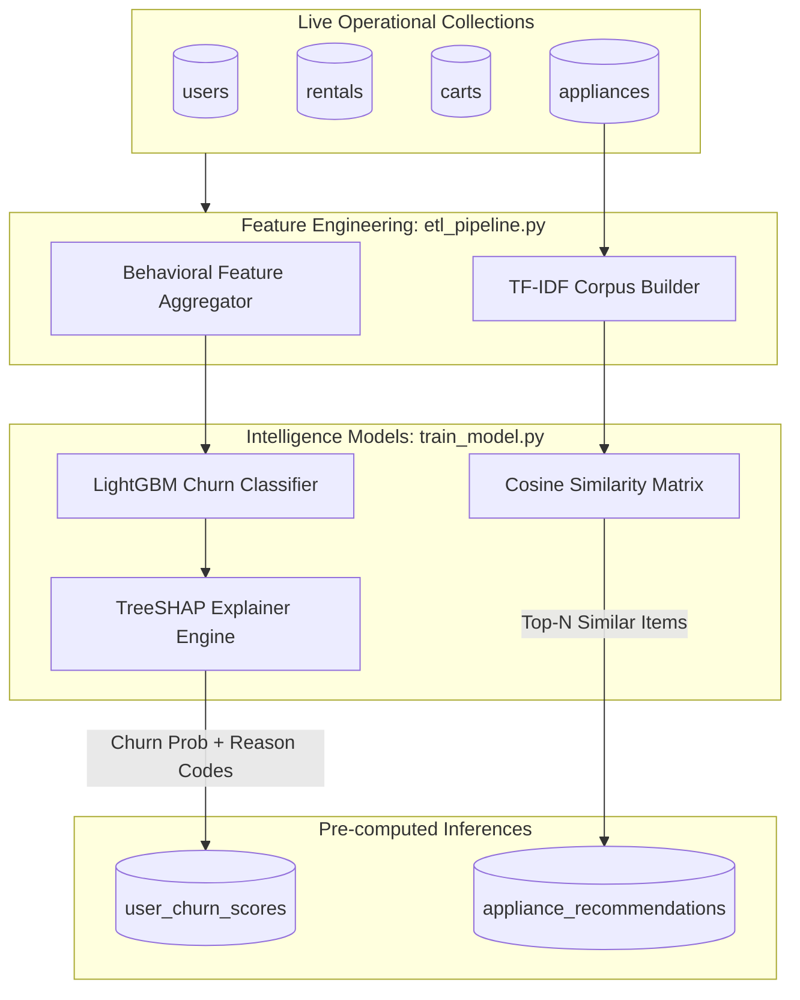

# AI / ML-Specific Engineering Document
## Project: Rentora – Smart Appliance Rental Platform
**Subsystems**: Predictive Churn Classification, TreeSHAP Explainability, and Content-Aware Recommender  
**Version**: 1.0.0  

---

## 1. Machine Learning Architectural Blueprint

The Rentora intelligence tier is architected to decouple analytical model training from live transactional web operations. Analytical extraction, gradient boosted tree inference, and vector space transformations occur asynchronously, synchronizing predictions directly to MongoDB collections (`user_churn_scores` and `appliance_recommendations`).



---

## 2. Behavioral Feature Engineering (`etl_pipeline.py`)

Customer transactions and interaction logs are transformed into standardized operational feature vectors $\mathbf{x} \in \mathbb{R}^8$:

| Feature Name | Type | Description | Operational Significance |
|---|---|---|---|
| `tenure_months` | Integer | Total accumulated customer tenure | Older customers show natural brand loyalty |
| `monthly_spend` | Float | Average monthly rental expenditure (INR) | High spenders represent higher business impact |
| `active_rentals` | Integer | Number of currently active appliance leases | Indicates level of ecosystem embedding |
| `late_payments` | Integer | Historical frequency of delayed payments | Strongest leading indicator of financial stress / churn |
| `early_returns` | Integer | Instances of premature lease terminations | Direct proxy for appliance dissatisfaction |
| `cart_abandonment`| Integer | Frequency of items added to cart but not leased | Signals price sensitivity or checkout hesitation |
| `days_inactive` | Integer | Consecutive days without platform interaction | Leading indicator of disengagement |
| `avg_rating` | Float | Mean review score provided by customer ($1.0 - 5.0$) | Direct sentiment indicator |

---

## 3. Customer Churn Prediction Engine (Model 1: LightGBM)

### 3.1 Algorithmic Formulation
LightGBM constructs an ensemble of $K$ decision trees:
$$\hat{y}_i = \sum_{k=1}^{K} f_k(\mathbf{x}_i), \quad f_k \in \mathcal{F}$$
minimizing the regularized binary log-loss:
$$\mathcal{L}^{(t)} = \sum_{i=1}^{n} \left[ y_i \log(1 + e^{-\hat{y}_i^{(t)}}) + (1 - y_i)\log(1 + e^{\hat{y}_i^{(t)}}) \right] + \sum_{k=1}^{t} \Omega(f_k)$$
where $\Omega(f) = \gamma T + \frac{1}{2}\lambda \sum_{j=1}^T w_j^2$.

### 3.2 Hyperparameter Configuration (`train_model.py`)
```python
lgb_params = {
    'objective': 'binary',
    'metric': 'auc',
    'boosting_type': 'gbdt',
    'learning_rate': 0.05,
    'num_leaves': 31,
    'max_depth': 6,
    'feature_fraction': 0.8,
    'bagging_fraction': 0.8,
    'bagging_freq': 5,
    'min_child_samples': 20,
    'random_state': 42
}
```

---

## 4. Explainable AI (XAI) via TreeSHAP

### 4.1 Theoretical Foundation
To make black-box tree predictions interpretable for retention operations, Rentora implements **TreeSHAP** based on cooperative game theory:
$$\phi_i(x) = \sum_{S \subseteq F \setminus \{i\}} \frac{|S|!(|F| - |S| - 1)!}{|F|!} \left[ f_x(S \cup \{i\}) - f_x(S) \right]$$
where $F$ is the complete feature set and $S$ is a feature subset.

### 4.2 Translating Shapley Values to Plain-Language Reason Codes
In `train_model.py`, raw positive Shapley attributions ($\phi_i > 0$) are programmatically mapped to intuitive operational explanations:

```python
def generate_shap_reason(feature_contributions):
    # Sort features by highest positive attribution toward churn
    top_driver = sorted(feature_contributions.items(), key=lambda x: x[1], reverse=True)[0]
    feature_name, shap_val = top_driver
    
    reasons_map = {
        'late_payments': "High frequency of delayed rental payments",
        'early_returns': "Premature appliance returns detected",
        'days_inactive': "Over 20+ days of platform inactivity",
        'avg_rating': "Low user satisfaction rating reported",
        'cart_abandonment': "Repeated cart checkout abandonments"
    }
    return reasons_map.get(feature_name, "Elevated behavioral churn risk")
```

---

## 5. Content-Aware Recommendation Engine (Model 2: TF-IDF & Cosine Similarity)

### 5.1 Text Vectorization
To eliminate cold-start issues in equipment leasing, product metadata is combined into composite document strings:
$$\text{Document}_j = \text{Category}_j \oplus \text{Title}_j \oplus \text{Specs}_j \oplus \text{Description}_j$$

We apply sublinear TF scaling:
$$\text{TF}(t, d) = 1 + \log(\text{frequency}(t, d))$$
$$\text{IDF}(t, D) = \log\left( \frac{1 + |D|}{1 + \text{DF}(t, D)} \right) + 1$$

### 5.2 Pairwise Similarity Computation
Given the TF-IDF matrix $\mathbf{V}$, the similarity matrix $\mathbf{S}$ is:
$$\mathbf{S}_{ij} = \frac{\mathbf{v}_i \cdot \mathbf{v}_j}{\|\mathbf{v}_i\|_2 \|\mathbf{v}_j\|_2}$$

For a customer who previously rented item $i$, recommendations are fetched by selecting:
$$\text{TopRecommendations}(i) = \arg\max_{j \neq i}^{(k)} \mathbf{S}_{ij}$$

---

## 6. Operational Synchronization to MongoDB

The pipeline updates MongoDB in bulk using `UpdateOne` with `upsert=True`:
```python
# Synchronizing scores to MongoDB
operations = [
    UpdateOne(
        {"user_id": uid},
        {"$set": {
            "churn_risk_score": float(score),
            "shap_reason": reason,
            "last_updated": datetime.utcnow()
        }},
        upsert=True
    )
    for uid, score, reason in predictions
]
db.user_churn_scores.bulk_write(operations)
```
This guarantees that operational web requests to `/api/recommendations/` and `/api/admin/dashboard/` execute in **sub-50ms** without triggering dynamic model inference.
